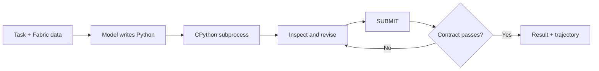
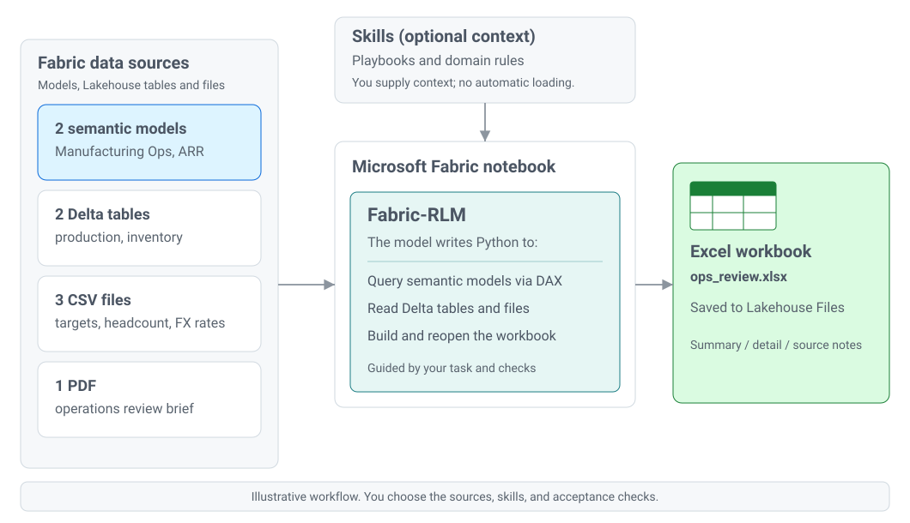

# Fabric-RLM

[](https://github.com/pawarbi/fabric-rlm-core/actions/workflows/test.yml)
[](https://pypi.org/project/fabric-rlm/)
[](https://pypi.org/project/fabric-rlm/)
[](LICENSE)


Run verifiable data tasks inside Microsoft Fabric.

`fabric-rlm` gives a model a Python workspace next to your Fabric data. It can
read Lakehouse files, query Power BI semantic models, calculate results, and
write new artifacts. Output contracts and validators decide whether the work is
accepted. Failed checks go back into the run for another attempt.

The runtime uses a CPython subprocess inside the notebook session. pandas,
DuckDB, Polars, openpyxl, PyMuPDF, and other installed packages remain
available. Large files stay on disk. The model sees previews, summaries, and
computed results rather than every raw byte.

## Quick start in Fabric

Install `fabric-rlm` in a Fabric notebook, Python notebook is recommended.

```python
%pip install fabric-rlm
```

After installation:

```python
from fabric_rlm import FabricLM, File, RLM

result = RLM.task(
    task="Find the root cause of the failed Spark job and cite the relevant log lines.",
    inputs={
        "log": File("/lakehouse/default/Files/logs/application.log"),
    },
    outputs={
        "root_cause": str,
        "evidence": list,
    },
    lm=FabricLM("gpt-5.1"),
).run()

print(result.root_cause)
print(result.evidence)
```

`FabricLM` uses the model endpoint available to the Fabric capacity. The
notebook identity supplies authentication. There is no API key to place in the
notebook and no separate Azure OpenAI resource to configure. You can see the list of supported models [here](https://learn.microsoft.com/en-us/fabric/data-science/ai-services/ai-services-overview#consumption-rate-for-openai-language-models).
You can also choose use any model from OpenAI, Anthropic, Foundry, OpenRouter using LiteLLM.

## What happens during a run

1. You provide a task, named inputs, and an output contract.
2. The model writes Python for the task.
3. The Python runs in a persistent subprocess with access to mounted Lakehouse
   files and installed packages.
4. Execution output returns to the model. It can inspect results and revise the
   code.
5. The run calls `SUBMIT(...)`.
6. Type checks, skill verifiers, and your validators inspect the submission.
7. A rejected submission returns with specific repair feedback.
8. An accepted submission becomes an `RLMResult` with the payload and full
   trajectory.



## Why Fabric developers use it

### Work with Fabric data in place

Bind Lakehouse files with `File(...)`. Bind Power BI semantic models with
`SemanticModel(...)`. A single task can use both. DAX runs in the tabular
engine, file processing runs in Python, and generated artifacts can be written
back to `Files/`.

### Use the Python packages already in the notebook

The subprocess runs the same Python environment as the notebook. Generated code
can import native packages and work with real file paths. This is the main
difference from the Deno and Pyodide interpreter used by DSPy's standard RLM.

### Check the work before accepting it

Output mappings enforce runtime types. `output_validator` can enforce business
rules. `output_validator_context` can inspect files and other side effects.
Markdown skills can include their own verifier. A failed check becomes feedback
for the next attempt.

### Keep domain rules beside the data

Skills are Markdown playbooks. They capture field definitions, procedures,
tripwires, and executable checks. Store custom skills in Lakehouse Files and
load them with `SkillLoader`. Bundled and custom skills can be used together.

### Inspect each run

`RLMResult` includes the submitted payload, executed turns, errors, timings,
token usage, validation repairs, and a deterministic report. Trajectories can be
saved and replayed without calling the model again.

## Where it fits

Use `fabric-rlm` for tasks that need one or more of these:

- Data that is too large to place in a model prompt
- Exact calculation across many rows or files
- Power BI semantic model queries mixed with Lakehouse files
- Workbook, report, or document generation
- Multi-step analysis with checkable outputs
- Reusable domain instructions and validation rules
- An execution trail for debugging and review

A direct model call is usually a better choice for short questions, rewriting,
or judgment over text that already fits in context. The runtime adds Python
execution and iterative checks, so each run takes longer than a single call.

## Start with the API tour

Import
[examples/notebooks/rlm_api_tour.ipynb](examples/notebooks/rlm_api_tour.ipynb)
into a Fabric workspace. It covers task construction, typed outputs, files,
custom Lakehouse skills, validators, result inspection, and worker controls.

The other notebooks cover PDF work, Spark log analysis, spreadsheet editing,
semantic models, and multi-source tasks.

## Measured results

The benchmarks are included for readers who want the evaluation setup, costs,
and caveats. They are not required to use the library.

<details>
<summary><strong>Open benchmark results and reproducibility notes</strong></summary>

### Large-file workbook comparison

One task, two attempts. The task: from a 140 MB IMF CPI pull (1.5 million rows,
194 countries, fetched live from the public SDMX API), build a formatted Excel
report: a pivot of the 10 highest-inflation countries by year, a merged title
cell, styled headers, and a second sheet listing every qualifying country.

The first attempt gives gpt-5.1 the question plus as much raw CSV as
fits in a prompt. The second gives gpt-5-mini, about 5x cheaper, the same
question through the RLM. Measured result:

| run | result | workbook | tokens | cost | seconds |
|---|---|---|---|---|---|
| plain call, gpt-5.1 | failed | none | 109,480 | $0.138 | 8.4 |
| RLM, gpt-5-mini | passed | correct, verified | 47,642 | $0.023 | 78.4 |

gpt-5.1 burned 109K tokens discovering the data was never in its context.
The mini model wrote DuckDB and openpyxl code in the subprocess, built the
workbook, and a deterministic ground-truth query verified every cell. The
failed call cost six times more than the successful one. The notebook then
pushes the same mini model through a harder task (finding inflation streaks
with tie-breaks, conditional formatting, and an embedded chart, cleared for
about two cents), runs an honest skill ablation, and finishes with the
two-source task. Run it yourself:
[examples/notebooks/rlm_vs_plain_llm_imf_cpi.ipynb](examples/notebooks/rlm_vs_plain_llm_imf_cpi.ipynb).

### SpreadsheetBench Verified-400

[SpreadsheetBench](https://github.com/RUCKBReasoning/SpreadsheetBench-2) tests
whether an agent can carry out real spreadsheet-manipulation instructions,
graded cell-exactly against golden workbooks. On the full Version 1
Verified-400 set (all 400 questions, single attempt each, temperature 1.0,
fabric-rlm 0.2.8 with the `excel_modify` skill and workbook structure context,
model served from MiniMax's first-party endpoint):

| system | model | pass rate | model spend |
|---|---|---|---|
| fabric-rlm | MiniMax M3 (open weights, $0.30/M in, $1.20/M out) | **82.5%** (330/400) | $2.61 total, $0.0065 per question |

That 82.5 percent is the score reported by the benchmark's own
`evaluation.py`, run unmodified over our output workbooks, so it is measured the
same way as every figure below. It is self-reported in the sense that we ran the
script ourselves; an official submission is planned.

For context, the top of the public V1-Verified (400) leaderboard is held by
commercial spreadsheet products: Qingqiu Agent at 98.25, ByteDance's Data
Analysis Agent at 96.5, GPT for Excel at 92.5, WPS AI at 91.25. Ours comes from
an open-source library driving a cheap open-weight model, at a cost of well
under a cent per task.


For scale, two vendors publish a result for Claude Opus 4.6 driven by a bare
prompt with no agent loop: 321/400 = 80.2 percent
([DealGlass results repo](https://github.com/arthursolwayne/spreadsheet-agents))
and 80.25 percent (Leni). Opus 4.6 tokens are priced roughly 17 times higher on
input and 21 times higher on output than MiniMax M3. So an open-source runtime
driving an open-weight model with a spreadsheet skill scores slightly above a
frontier model asked directly, at a small fraction of the per-token price. Two
caveats worth stating plainly: that comparison is against a single-shot prompt,
and the same Opus 4.6 inside a purpose-built scaffold reaches 95.2 percent, so the
honest reading is that scaffolding matters more than model choice, not that one
model beats another. All three figures are self-reported.

Reproduce it with
[examples/notebooks/ssb400_minimax_m3_fabric_repro.ipynb](examples/notebooks/ssb400_minimax_m3_fabric_repro.ipynb);
the run needs an OpenRouter key and costs a few dollars.

### AIDABench

SpreadsheetBench hands you one workbook and tells you which cells to fill.
[AIDABench](https://arxiv.org/abs/2603.15636) is closer to real analyst work: read
one or more source files, decide the shape of the answer yourself, and write a new
file. 41 percent of its file-generation tasks span multiple inputs, up to 13 in a
single task, and the target range is never given.

Same library, same MiniMax M3, no per-benchmark tuning:

| split | fabric-rlm + MiniMax M3 | best in the paper | cost per task |
|---|---|---|---|
| File generation (261 tasks) | ~42% | 49.4% (Claude Sonnet 4.5) | $0.023 vs $0.237 |
| Question answering (226 tasks) | 63.6% | 68.6% (Claude Sonnet 4.5) | $0.012 vs $0.122 |


That is five to seven points behind the leading model at roughly a tenth of the
cost on both splits, which puts it mid-table against the eleven models in the
paper. The cost figures price identical token usage at each model's published
rate, so they compare workloads rather than observed spend.

The third split, data visualization, was not run. Its deliverable is a chart image
graded on presentation rubrics, which needs a vision-capable judge and
chart-construction guidance this library does not ship.

File-generation scores were checked against AIDABench's own evaluator, run
unmodified, on a 62-task sample: 41.9 percent against our judge's 43.5 percent. QA
was graded with their `eval_QA.py` under two different grader models, which agreed
on 94.6 percent of answers.

The runners, both graders, every trajectory, the grader calibration, and an
account of the seven grading bugs found along the way are in
[pawarbi/fabric-rlm-benchmarks](https://github.com/pawarbi/fabric-rlm-benchmarks).
These are single-seed numbers. Two identical runs agreed on 84 percent of tasks,
so treat differences under about ten points as noise.

</details>

## Fabric data sources

Fabric notebooks already provide mounted Lakehouse storage, `sempy`, notebook
identity, and the Python analytics stack. `fabric-rlm` exposes those resources
to the run through typed handles. The task can combine semantic model queries
with CSV, PDF, Excel, Parquet, and JSONL files without building a separate
ingestion path.

<picture>
  <source media="(prefers-color-scheme: dark)" srcset="docs/assets/multisource-dark.svg">
  
</picture>

Every source is bound as an input and the model decides which one answers which
part of the brief. The semantic models are queried with DAX in the tabular
engine, so aggregation happens where the data is and only the result comes
back. The files are read in the subprocess. The workbook is written straight to
`Files/`.


## Installation

Python 3.10 or newer is required. In Fabric, select the Python 3.12
(`jupyter_python`) kernel. Install the package and restart the session:

```python
%pip install fabric-rlm
```

If imports fail on the Synapse PySpark kernel, see
[docs/fabric-runtime-deps.md](docs/fabric-runtime-deps.md).

Optional extras install packages used by specific workloads:

| Extra | Adds | Use it for |
|---|---|---|
| `fabric-rlm[pdf]` | PyMuPDF | PDF analysis and extraction |
| `fabric-rlm[analytics]` | DuckDB, Polars | Large CSV, Parquet, and JSONL analysis |
| `fabric-rlm[fabric]` | SynapseML | Fabric model integration when the runtime does not provide it |
| `fabric-rlm[dev]` | pytest and development tools | Local development |

## Other Python environments

The runtime also works on a laptop, in CI, or in an Azure Function. Use
`OpenAILM` or `AnthropicLM` with the matching environment variable:

```python
from fabric_rlm import File, OpenAILM, RLM  # set OPENAI_API_KEY in your environment

rlm = RLM.task(
    task="Sum every integer from 1 to 1,000,000 that is divisible by 3 or 5.",
    outputs=["answer"],
    lm=OpenAILM("gpt-4o-mini"),
)
print(rlm.run().answer)
```

`RLM.task(...)` is the short constructor; `RLM.from_task(...)` is the explicit
form. `OpenAILM`, `AnthropicLM`, and `FabricLM` are thin wrappers over `dspy.LM`,
so any OpenAI, Anthropic, Azure, or local Ollama model works.

Use a mapping when an output needs a runtime type contract:

```python
result = RLM.task(
    task="Return the highest-revenue region and its revenue.",
    inputs={"sales": File("sales.csv")},
    outputs={"result": dict},
    lm=OpenAILM("gpt-4o-mini"),
).run()
```

If `SUBMIT(result=...)` receives the wrong type, the submission is rejected and
the model gets repair feedback. Name-only lists such as `outputs=["answer"]`
remain supported and do not add type enforcement.

## Inputs and worker API

### Values and files

Bind values, including large files, as inputs. Files arrive
inside the worker as `File(...)` handles with `.path`, `.read_text()`,
`.read_bytes()`, and `.exists()`, so a Lakehouse path or a local path is just a
file path.

### Semantic models

A Power BI semantic model binds the same way and arrives as a connected handle:

```python
from fabric_rlm import FabricLM, RLM, SemanticModel

RLM.task(
    task="Which product line has the highest recurring revenue?",
    inputs={"arr": SemanticModel("ARR Model SF (79)")},
    outputs=["answer"],
    lm=FabricLM("gpt-5.1"),
).run()
```

Inside the run, `arr.schema()` returns tables, measures with their DAX
expressions and descriptions, and relationships in one call. `arr.dax("EVALUATE
...")` returns a DataFrame, and `arr.measure(name, groupby=[...],
filters={...})` evaluates a model measure without authoring DAX. Pass
`workspace=` for a model outside the attached workspace.

Bind several at once and the model routes between them:

```python
inputs={
    "mfg": SemanticModel("Manufacturing Ops"),
    "arr": SemanticModel("ARR Model SF (79)"),
}
```

This needs a Fabric notebook, where `sempy` ships in the runtime. The dataset
name is checked when you construct `SemanticModel`, so a typo fails on that
line rather than several turns into a run.

The handle gives generated code a clear entry point. Across two semantic models
and two model families, tasks scored 18-19/19 and 13/15 with the handle. The
same tasks scored 7/19 and 5/15 when they only named the semantic model.

### Submission contract

The runtime injects `SUBMIT(...)`. Call it with keyword arguments matching the
declared `outputs`, or with positional arguments in the same order. After a
valid submission, `result.payload` holds the dictionary and each field is also
available as an attribute such as `result.answer`.

### Nested model calls

Inside its Python, the model can call a nested model with
`predict_sync("english -> french", english=phrase)` (or the async `predict`),
optionally routed to a cheaper `sub_lm=`.

## Engines

`RLM` ships with three stable engines, plus the experimental `adaptive`:

| Engine | What it does | When to pick it |
|---|---|---|
| `"auto"` (default) | Uses `"dspy"` when a non-empty `tools=[...]` is passed, otherwise `"default"` | You don't want to think about it. Recommended. |
| `"default"` | Custom loop with skills, router, reflection, and verifier | You want skills and multi-turn verifier feedback. |
| `"dspy"` | Delegates to `dspy.predict.RLM` with the subprocess as its backend | You want dspy-native composability or `tools=`. |
| `"adaptive"` | Escalates compute (more turns, then higher reasoning effort, then best-of-N, then a stronger LM) when a validator rejects an attempt | Hard, verifiable tasks. Experimental (opt-in `UserWarning`). |

The default `core` skill carries a PLAN / VERIFY / REFLECT contract: plan before
running code, self-check before SUBMIT, and carry prior-attempt failures into
retries. It is on by default. Set `FABRIC_RLM_PVR=0` to turn it off for
token-sensitive batch runs on trivial tasks.

## Skills

Skills are Markdown playbooks that tell the model how to do a kind of work
properly: which library to reach for, the traps to avoid, and what to check
before submitting. Eight ship with the package. Name the ones a task needs and
they are prepended to the prompt. The keyword router can also select them from
the task and input names.

```python
from fabric_rlm import RLM, File, FabricLM

rlm = RLM.task(
    task="Rebuild the summary tab from the raw export and flag any variance over 5 percent.",
    inputs={"workbook": File("/lakehouse/default/Files/finance/q3.xlsx")},
    outputs=["answer"],
    lm=FabricLM("gpt-5.1"),
    skills=["excel_modify", "data_exploration"],   # load as many as the task needs
)
print(rlm.run().answer)
```

| Skill | What it covers |
|---|---|
| `excel_modify` | Editing `.xlsx` in place with openpyxl: writing computed values rather than formula strings, merged-cell anchors, target-range discipline, verifying by reloading |
| `excel_extract` | Reading workbooks: locating real header rows, multi-table sheets, formula versus cached value, pulling structured records out of messy layouts |
| `data_exploration` | Files too large for context: DuckDB and Polars over CSV, Parquet and JSONL, aggregating in code so raw rows never reach the prompt |
| `pdf_document_analysis` | Long documents with PyMuPDF: page enumeration, chunking, and per-chunk extraction |
| `semantic_model` | Power BI semantic model discovery, measure selection, DAX queries, and result validation |
| `core` | The PLAN / VERIFY / REFLECT contract applied to every run |
| `validation` | Checking an answer against the task's constraints before submitting |
| `error_handling` | What to do when a turn raises, so the next turn fixes rather than repeats |

The five domain skills are keyword-routed. For example, `data_exploration`
activates when a task or input name mentions logs or CSV files. The core and
utility skills provide planning, validation, and error recovery.

### Writing your own

A skill is one Markdown file with a small frontmatter block. Put it anywhere the
notebook can read, including Lakehouse `Files`, and point a `SkillLoader` at that
folder:

```python
from fabric_rlm import RLM, SkillLoader, FabricLM

loader = SkillLoader(skill_dir="/lakehouse/default/Files/skills")
print(loader.list_skills())        # your skills plus the bundled ones

rlm = RLM.task(
    task="Extract the vendor totals from this invoice.",
    inputs={"doc": File("/lakehouse/default/Files/invoices/2026-07.pdf")},
    outputs=["totals"],
    lm=FabricLM("gpt-5.1"),
    skill_loader=loader,
    skills=["invoice_rules", "pdf_document_analysis"],
)
```

Your folder layers over the bundled skills rather than replacing them, so you can
mix your own with the shipped ones in the same `skills=[...]` list. Pass several
folders as a list if you keep them apart, and a file named after a bundled skill
overrides it. If you want only your own, pass `include_packaged=False`.

### Contributed skills

`contrib-skills/` in the repository holds playbooks that are not installed with the
package, either because they are narrower than the bundled ones or because the
measurements behind them are thinner than a default install should carry. Point a
loader at the folder to use one:

```python
from fabric_rlm import RLM, File, SkillLoader

loader = SkillLoader(skill_dir="contrib-skills")

rlm = RLM.task(
    task="What was Boeing's FY2022 core operating loss? Report the figure with its sign.",
    inputs={"filing": File("BOEING_2022_10K.pdf")},
    outputs=["answer"],
    skill_loader=loader,
    skills=["pdf_document_analysis", "financial_documents"],
)
```

`financial_documents` is the first of these: reporting conventions for 10-K, 10-Q
and earnings releases, covering parentheses as negative, scale stated in a header,
fiscal against calendar year, adjacent period columns and subtotal rows. It is
scoped to financial reporting on purpose, since parentheses mean something else in
legal and scientific documents. [docs/contrib-skills.md](docs/contrib-skills.md)
records what it was measured on and what the measurement does not support.

If a skill needs a library fabric-rlm does not depend on, install it in the
notebook (`%pip install python-docx`) before running. The sandbox blocks `pip`
and `subprocess`, so a skill cannot install its own dependencies. See
[docs/authoring-skills.md](docs/authoring-skills.md).

This is how house rules stop being tribal knowledge: your chart of accounts, the
naming conventions your reports use, the columns that are always dates. Write it
once, store it beside the data, and every run reads from the same copy.

Start from [docs/skill-template.md](docs/skill-template.md); the structure is
documented in [docs/authoring-skills.md](docs/authoring-skills.md).

## Security

This library runs model-generated code. The default `SecurityPolicy` scrubs
secret-bearing environment variables from the worker, screens generated code,
and blocks destructive Lakehouse operations such as `notebookutils.fs.rm` and
`mssparkutils.fs.mv`. The worker remains inside the notebook trust boundary.
Read [SECURITY.md](SECURITY.md) before using untrusted prompts with sensitive
data or credentials.

## CLI

```bash
fabric-rlm --version
fabric-rlm run examples/simple_math/task.json      # run a task from JSON
fabric-rlm trace inspect path/to/trajectory.jsonl  # summarize and diagnose a saved run
```

## Documentation

- [QUICKSTART.md](QUICKSTART.md): step-by-step guide covering install, first run,
  Fabric notebook usage, sub-LM calls, traces, and skill authoring.
- [docs/fabric-runtime-deps.md](docs/fabric-runtime-deps.md): read this if a
  Fabric notebook fails at import time (`Sentinel`, `yarl.Query`,
  `aiohttp.ConnectionTimeoutError`).
- [docs/lossless-submit-payloads.md](docs/lossless-submit-payloads.md): how final
  payloads avoid namespace-snapshot truncation.
- [examples/notebooks/](examples/notebooks/): ready-to-import Fabric recipes.
  Start with `rlm_vs_plain_llm_imf_cpi.ipynb` (the with-and-without comparison)
  and `rlm_api_tour.ipynb`, then the PDF workflows, the Spark-log root-cause
  analysis, and the SpreadsheetBench benchmarks.
- [CHANGELOG.md](CHANGELOG.md): release history.

## Develop

```bash
git clone https://github.com/pawarbi/fabric-rlm-core.git
cd fabric-rlm-core
pip install -e ".[dev]"
pytest -q
```

See [CONTRIBUTING.md](CONTRIBUTING.md) for the development workflow.

## Acknowledgments

fabric-rlm builds on the following work:

- The Recursive Language Model paradigm comes from the paper
  [Recursive Language Models](https://arxiv.org/abs/2512.24601) by Alex L.
  Zhang, Tim Kraska, and Omar Khattab (MIT CSAIL), which showed that letting a
  model programmatically examine and recursively query its own prompt beats
  stuffing everything into context.
- [DSPy](https://github.com/stanfordnlp/dspy) provides the RLM predictor and
  the interpreter protocol this library plugs into, and `dspy.LM` powers every
  model backend here.
- [Predict-RLM](https://github.com/Trampoline-AI/predict-rlm) by Trampoline AI,
  a production-focused RLM runtime built on DSPy signatures, inspired the
  direction of this project.

## License

MIT. See [LICENSE](LICENSE).
