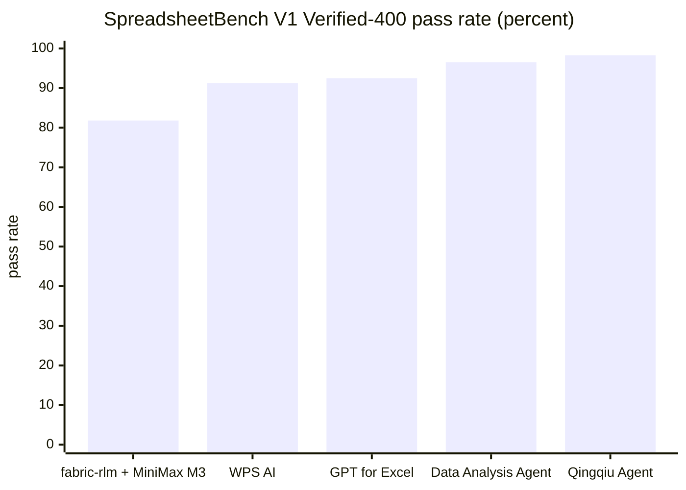
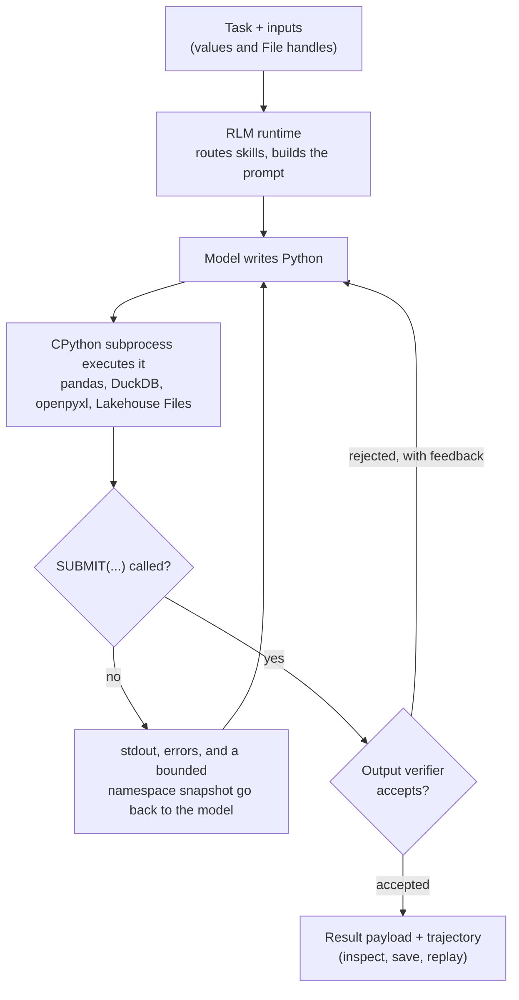

# fabric-rlm

[](https://github.com/pawarbi/fabric-rlm-core/actions/workflows/test.yml)
[](https://pypi.org/project/fabric-rlm/)
[](https://pypi.org/project/fabric-rlm/)
[](LICENSE)

Recursive Language Models (RLMs) for Microsoft Fabric notebooks. The model writes
Python, the code runs in a real CPython subprocess, and the model keeps iterating
(reading outputs, fixing its own errors) until it calls `SUBMIT(...)` with the
answer. It also runs anywhere else CPython runs: your laptop, CI, or an Azure
Function.

## Why not dspy's RLM directly in a notebook

dspy ships its own `RLM`, but it executes generated code in a Deno + Pyodide
(WASM) sandbox. That runtime is impractical to stand up in a Fabric notebook, and
because it is WASM-isolated it cannot import the notebook's installed Python
packages or reach the mounted Lakehouse. fabric-rlm keeps dspy's RLM loop and
replaces the interpreter with a CPython subprocess that runs inside the notebook
process. The model's code gets the full Python ecosystem (pandas, DuckDB, Polars,
openpyxl, PyMuPDF) and can read and write Lakehouse `Files` paths directly. The
raw bytes stay in the subprocess; only the model's summaries and computed results
go back through the LM, so it works on files far larger than any context window.

## What you get

- Built for Fabric notebooks: runs where dspy's Deno/Pyodide RLM can't, and reads
  and writes the mounted Lakehouse filesystem directly.
- No key and no resource to provision on Fabric: `FabricLM` uses the capacity's
  built-in Azure OpenAI endpoint (details below).
- Real subprocess execution: full CPython, native libraries, and real files.
- Reusable skills: Markdown playbooks for PDFs, tabular/log EDA, and Excel, with a
  keyword router that loads only what a task needs.
- A self-correcting loop: a PLAN / VERIFY / REFLECT contract and an output
  verifier feed failures back to the model so it fixes its own code.
- Three engines plus an experimental adaptive one, including native
  `dspy.predict.RLM` interop.
- A default security policy that scrubs secret-bearing environment variables and
  blocks destructive Lakehouse operations (`notebookutils.fs`, `mssparkutils`).
- Structured trajectories you can inspect, save to the Lakehouse, and replay
  offline.
- Runs locally too, and ships `py.typed`.

## When to use an RLM (and when not to)

An RLM earns its overhead when the task needs computation, iteration, or data
that will not fit in a context window. For a quick question or a conversational
task, a plain LLM call is cheaper and faster; the loop and the subprocess add
nothing.

Use an RLM when:

- The data is larger than any context window. Multi-gigabyte Spark logs, wide
  Excel workbooks, long JSONL streams: the model queries them with DuckDB,
  Polars, or openpyxl inside the subprocess, and only its aggregates enter the
  LM context. This is what the `data_exploration` skill was built for.
- The answer must be computed exactly or written to a file. An LLM cannot
  reliably do arithmetic over thousands of rows or edit an `.xlsx` in place; code
  can. On the full SpreadsheetBench Verified-400, MiniMax M3 through this RLM
  passes 81.8 percent of questions for about $2.50 of total model spend; see
  the benchmark section below.
- The task is multi-step and its output is checkable. With a validator attached,
  failed attempts feed structured reflection into retries: in the ablation, a
  hard multi-step task went from ladder-exhausted failure to passing, with 68%
  fewer tokens.
- You need strict multi-field extraction from long documents. The same ablation
  measured a 74% token reduction on a 100KB RFP extraction with the
  plan/verify contract on.

Skip the RLM when:

- It is a conversation, a rewrite, or a judgment call over text that fits in
  context. There is nothing to compute, so a single LM call wins.
- The model nails the task in one shot. The ablation caught this failure mode
  directly: on an easy log-extraction task the verify loop spuriously re-checked
  a correct first answer, inflating cost from 6K to 40K tokens and 10 seconds to
  176. Correctness held, but a plain call would have been 10x cheaper.
- The task exceeds the model's capability. The loop retries more cheaply, but it
  does not rescue tasks the model fundamentally cannot solve; use a stronger
  model instead.

### A worked example

One task, two attempts. The task: from a 140 MB IMF CPI pull (1.5 million rows,
194 countries, fetched live from the public SDMX API), build a formatted Excel
report: a pivot of the 10 highest-inflation countries by year, a merged title
cell, styled headers, and a second sheet listing every qualifying country.

The first attempt gives gpt-5.1 the question plus as much raw CSV as
fits in a prompt. The second gives gpt-5-mini, about 5x cheaper, the same
question through the RLM. Measured result:

| run | workbook | tokens | cost | seconds |
|---|---|---|---|---|
| plain call, gpt-5.1 | none | 109,480 | $0.138 | 8.4 |
| RLM, gpt-5-mini | correct, verified | 47,642 | $0.023 | 78.4 |

gpt-5.1 burned 109K tokens discovering the data was never in its context.
The mini model wrote DuckDB and openpyxl code in the subprocess, built the
workbook, and a deterministic ground-truth query verified every cell. The
failed call cost six times more than the successful one. The notebook then
pushes the same mini model through a harder task (finding inflation streaks
with tie-breaks, conditional formatting, and an embedded chart, cleared for
about two cents) and closes with an honest skill ablation. Run it yourself:
[examples/notebooks/rlm_vs_plain_llm_imf_cpi.ipynb](examples/notebooks/rlm_vs_plain_llm_imf_cpi.ipynb).

### Benchmark: SpreadsheetBench Verified-400

[SpreadsheetBench](https://github.com/RUCKBReasoning/SpreadsheetBench-2) tests
whether an agent can carry out real spreadsheet-manipulation instructions,
graded cell-exactly against golden workbooks. On the full Version 1
Verified-400 set (all 400 questions, single attempt each, temperature 1.0,
fabric-rlm 0.2.8 with the `excel_modify` skill):

| system | model | pass rate | model spend |
|---|---|---|---|
| fabric-rlm | MiniMax M3 (open weights, $0.30/M in, $1.20/M out) | **81.8%** (327/400) | about $2.50 total, $0.006 per question |

For context, the top of the public V1-Verified (400) leaderboard is held by
commercial spreadsheet products: Qingqiu Agent at 98.25, ByteDance's Data
Analysis Agent at 96.5, GPT for Excel at 92.5, WPS AI at 91.25. Our number is
self-reported from the run logs in this repository (official submission
planned) and comes from an open-source library driving a cheap open-weight
model, at a cost of well under a cent per task.



One tuning note from an A/B on 100 of these questions: the opt-in workbook
context (`add_excel_workbook_context`, which prepends the workbook's sheet
names, dimensions, target ranges, and headers to the task so the model does
not have to discover them by running code) left the pass rate and cost
unchanged but cut the mean time per question from 39 to 23 seconds, because
the model skips its exploratory turns. Turn it on for interactive workloads;
it makes no difference to accuracy in batch runs.

Reproduce it with
[examples/notebooks/ssb400_minimax_m3_fabric_repro.ipynb](examples/notebooks/ssb400_minimax_m3_fabric_repro.ipynb);
the run needs an OpenRouter key and costs a few dollars.

## How it works, in one picture



The raw bytes of your files never enter the LM context. The model reads
summaries, previews, and computed aggregates; the heavy lifting happens in the
subprocess.

## Use it in a Fabric notebook

Install on the Python 3.12 `jupyter_python` kernel, then restart the session:

```python
%pip install fabric-rlm
# For the PDF skill and PDF notebooks, add the extra:
# %pip install fabric-rlm[pdf]
```

If imports fail on the Synapse PySpark kernel, see
[docs/fabric-runtime-deps.md](docs/fabric-runtime-deps.md).

On a paid Fabric capacity, `FabricLM` uses the capacity's built-in Azure OpenAI
endpoint. It discovers the endpoint through `synapse.ml.fabric` and authenticates
with the notebook's AAD token, refreshing it automatically on long runs. You do
not provision an Azure OpenAI resource and you do not manage an API key:

```python
from fabric_rlm import RLM, FabricLM, File

rlm = RLM.task(
    task="Find the root cause of the failure in this Spark log.",
    inputs={"log": File("/lakehouse/default/Files/logs/app.log")},
    outputs=["root_cause"],
    lm=FabricLM("gpt-5.1"),
)
print(rlm.run().root_cause)
```

Because the subprocess runs inside the notebook, the model's code reads and writes
mounted Lakehouse `Files` paths directly, and traces can be written back to the
Lakehouse. See [examples/notebooks/](examples/notebooks/) for ready-to-import
recipes; start with `rlm_api_tour.ipynb`.

## Run it locally

The same code runs on your laptop, in CI, or in an Azure Function. Use `OpenAILM`
or `AnthropicLM` with the matching API key instead of `FabricLM`:

```bash
pip install fabric-rlm
```

```python
from fabric_rlm import RLM, OpenAILM   # set OPENAI_API_KEY in your environment

rlm = RLM.task(
    task="Sum every integer from 1 to 1,000,000 that is divisible by 3 or 5.",
    outputs=["answer"],
    lm=OpenAILM("gpt-4o-mini"),
)
print(rlm.run().answer)
```

`RLM.task(...)` is the short constructor; `RLM.from_task(...)` is the explicit
form. `OpenAILM`, `AnthropicLM`, and `FabricLM` are thin wrappers over `dspy.LM`,
so any OpenAI, Anthropic, Azure, or local Ollama model works.

Requires Python 3.10 or newer. Optional extras:

| Extra | Adds | For |
|---|---|---|
| `fabric-rlm[pdf]` | PyMuPDF | the `pdf_document_analysis` skill and PDF notebooks |
| `fabric-rlm[analytics]` | DuckDB, Polars | large-file EDA with `data_exploration` |
| `fabric-rlm[fabric]` | SynapseML | Microsoft Fabric notebook integration |
| `fabric-rlm[dev]` | pytest | running the test suite |

## The worker API

Inputs and files. Bind values, including large files, as inputs. Files arrive
inside the worker as `File(...)` handles with `.path`, `.read_text()`,
`.read_bytes()`, and `.exists()`, so a Lakehouse path or a local path is just a
file path.

The SUBMIT contract. The runtime injects `SUBMIT(...)`. Call it with keyword
arguments matching your declared `outputs`, or with positional arguments in the
same order. After a valid SUBMIT, `result.payload` holds the dict and each field
is also reachable as an attribute (`result.answer`).

Recursive sub-LM calls. Inside its Python, the model can call a nested LM with
`predict_sync("english -> french", english=phrase)` (or the async `predict`),
optionally routed to a cheaper `sub_lm=`.

## Engines

`RLM` ships with three stable engines, plus the experimental `adaptive`:

| Engine | What it does | When to pick it |
|---|---|---|
| `"auto"` (default) | Uses `"dspy"` when a non-empty `tools=[...]` is passed, otherwise `"default"` | You don't want to think about it. Recommended. |
| `"default"` | Custom loop with skills, router, reflection, and verifier | You want skills and multi-turn verifier feedback. |
| `"dspy"` | Delegates to `dspy.predict.RLM` with the subprocess as its backend | You want dspy-native composability or `tools=`. |
| `"adaptive"` | Escalates compute (more turns, then higher reasoning effort, then best-of-N, then a stronger LM) when a validator rejects an attempt | Hard, verifiable tasks. Experimental (opt-in `UserWarning`). |

The default `core` skill carries a PLAN / VERIFY / REFLECT contract: plan before
running code, self-check before SUBMIT, and carry prior-attempt failures into
retries. It is on by default. Set `FABRIC_RLM_PVR=0` to turn it off for
token-sensitive batch runs on trivial tasks.

## Bundled skills

Skills are Markdown playbooks the router loads on demand:

- `pdf_document_analysis`: long-document analysis with PyMuPDF
- `data_exploration`: tabular and log EDA with pandas, Polars, and DuckDB
- `excel_extract` / `excel_modify`: read and edit `.xlsx` workbooks via openpyxl
- `core`, `validation`, `error_handling`: default scaffolding

Write your own by copying
[fabric_rlm/skills/SKILL_TEMPLATE.md](fabric_rlm/skills/SKILL_TEMPLATE.md). The
structure is documented in
[PLAYBOOK_CONTRACT.md](fabric_rlm/skills/PLAYBOOK_CONTRACT.md).

## Security

This library runs model-generated code. The default `SecurityPolicy` provides
guardrails, not isolation: it scrubs secret-bearing environment variables from the
worker, screens generated code through a configurable policy before it runs, and
blocks destructive Lakehouse operations (`notebookutils.fs.rm` / `mv`,
`mssparkutils` aliases). Read [SECURITY.md](SECURITY.md) before running untrusted
prompts against sensitive data or credentials.

## CLI

```bash
fabric-rlm --version
fabric-rlm run examples/simple_math/task.json      # run a task from JSON
fabric-rlm trace inspect path/to/trajectory.jsonl  # summarize and diagnose a saved run
```

## Documentation

- [QUICKSTART.md](QUICKSTART.md): step-by-step guide covering install, first run,
  Fabric notebook usage, sub-LM calls, traces, and skill authoring.
- [docs/fabric-runtime-deps.md](docs/fabric-runtime-deps.md): read this if a
  Fabric notebook fails at import time (`Sentinel`, `yarl.Query`,
  `aiohttp.ConnectionTimeoutError`).
- [docs/lossless-submit-payloads.md](docs/lossless-submit-payloads.md): how final
  payloads avoid namespace-snapshot truncation.
- [examples/notebooks/](examples/notebooks/): ready-to-import Fabric recipes.
  Start with `rlm_vs_plain_llm_imf_cpi.ipynb` (the with-and-without comparison)
  and `rlm_api_tour.ipynb`, then the PDF workflows, the Spark-log root-cause
  analysis, and the SpreadsheetBench benchmarks.
- [CHANGELOG.md](CHANGELOG.md): release history.

## Develop

```bash
git clone https://github.com/pawarbi/fabric-rlm-core.git
cd fabric-rlm-core
pip install -e ".[dev]"
pytest -q
```

See [CONTRIBUTING.md](CONTRIBUTING.md) for the development workflow.

## Acknowledgments

This project stands on the work of others, and it matters to say so:

- The Recursive Language Model paradigm comes from the paper
  [Recursive Language Models](https://arxiv.org/abs/2512.24601) by Alex L.
  Zhang, Tim Kraska, and Omar Khattab (MIT CSAIL), which showed that letting a
  model programmatically examine and recursively query its own prompt beats
  stuffing everything into context.
- [DSPy](https://github.com/stanfordnlp/dspy) provides the RLM predictor and
  the interpreter protocol this library plugs into, and `dspy.LM` powers every
  model backend here.
- [Predict-RLM](https://github.com/Trampoline-AI/predict-rlm) by Trampoline AI,
  a production-focused RLM runtime built on DSPy signatures, inspired the
  direction of this project.

## License

MIT. See [LICENSE](LICENSE).
