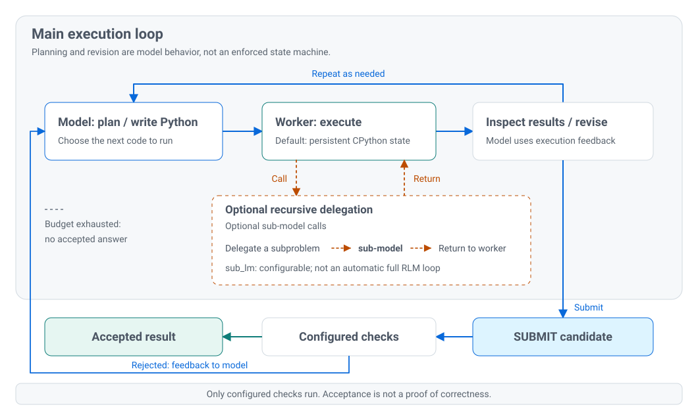

# Fabric-RLM

[](https://github.com/pawarbi/fabric-rlm-core/actions/workflows/test.yml)
[](https://pypi.org/project/fabric-rlm/)
[](https://pypi.org/project/fabric-rlm/)
[](LICENSE)

**Give a model a Python workspace next to your Microsoft Fabric data.**

**Designed and configured for data-intensive, long-context tasks in Microsoft
Fabric**, with source-aware tools, analytical playbooks, and checks for
structured outputs.

Fabric-RLM is an agentic harness built around the *Recursive Language Model*
approach. It gives a language model a persistent Python subprocess inside your
Fabric notebook environment, where it can execute code, inspect results, and
revise its work before submitting a structured answer.

Rather than requiring a separate tool for every analytical operation or a team
of sub-agents, its primary work surface is Python: the model uses installed
libraries to analyze Lakehouse files and Delta tables, query Power BI semantic
models, and create reports without putting an entire dataset into a prompt.
Host tools and recursive sub-model calls are optional, not prerequisites.

<picture>
  <source media="(prefers-color-scheme: dark)" srcset="docs/assets/multisource-dark.svg">
  
</picture>

*One notebook task, multiple sources, an inspectable workbook. Skills provide
optional context; you choose the sources and acceptance checks.*

**Beta.** Generated code and analytical answers need appropriate checks. Output
types enforce structure; they do not prove that an answer is correct.

[Start in Fabric](#quick-start-in-fabric) · [Example notebooks](examples/) ·
[API reference](docs/api-reference.md) · [Skills guide](docs/skills-guide.md)

## What you can do

| Work | Example |
| --- | --- |
| Analyze files larger than the context window | Filter and aggregate a 140 MB CPI dataset using Python and DuckDB |
| Work across Fabric sources | Combine Lakehouse files, Delta tables, and governed semantic-model measures |
| Produce inspectable artifacts | Build an Excel workbook, reopen it, and check its saved values |
| Investigate documents and logs | Extract invoice data, compare contracts, or inspect a Spark failure |

The worker is a persistent CPython subprocess in your notebook environment.
Installed libraries such as pandas, DuckDB, Polars, openpyxl, and PyMuPDF remain
available. This is Python execution, not a separate Spark execution engine.

## Quick start in Fabric

Use a **Fabric Python notebook**; Python 3.12 is recommended. Attach a Lakehouse
for `/lakehouse/default/Files` paths, then install:

```python
%pip install "fabric-rlm[analytics]"
```

**Restart the session after installation.** For a small first run with generated
fixtures, import the [API tour](examples/notebooks/rlm_api_tour.ipynb).

The example below combines **three sources for one sales review**. Replace the
workspace, model, and Lakehouse IDs with your own. It assumes a semantic model
with a `Net Revenue` measure and month/region dimensions, a `dbo.sales` Delta
table with order-level detail, and a CSV with `month`, `region`, and
`target_revenue` columns (one row per month/region). All three must use compatible
region keys, calendar months, revenue definitions, and currency. You need read
access to each source; these are example business schemas, not bundled fixtures.

```python
from fabric_rlm import FabricLM, File, LakehouseSource, RLM, SemanticModel

workspace_id = "<workspace-id>"
lakehouse_id = "<lakehouse-id>"

result = RLM.task(
    task="""
    Review sales for report_month. Inspect all three source schemas first.
    Use the semantic model's Net Revenue measure as the governed actual,
    grouped by region, and compare it with the CSV targets. Return actual,
    target, and variance (actual minus target) for each region.
    Use the Lakehouse sales detail to identify the largest product-level
    revenue contributions in regions below target. Aggregate before joining;
    reconcile detail totals to the measure under the same filters.
    Report mismatches or missing coverage rather than inventing an explanation.
    """,
    inputs={
        "report_month": "2026-08",
        "actuals": SemanticModel("<semantic-model-id>", workspace=workspace_id),
        "sales_detail": LakehouseSource(
            f"abfss://{workspace_id}@onelake.dfs.fabric.microsoft.com/"
            f"{lakehouse_id}/Tables/dbo/sales"
        ),
        "targets": File("/lakehouse/default/Files/sales_targets.csv"),
    },
    outputs={
        "regional_results": list,
        "product_contributions": list,
        "reconciliation_notes": str,
        "sources_used": list,
    },
    lm=FabricLM("gpt-5.1"),
    skills=["semantic_model", "delta_lakehouse", "data_exploration"],
    max_turns=12,
).run()

print(result.payload)
result.inspect()
```

The Delta path scopes discovery to one table; change it for your table/schema.
The CSV path refers to the notebook's attached Lakehouse. These instructions
request reconciliation; the output types alone do not enforce its correctness.

**No model provisioning required with FabricLM.** In a supported paid Fabric
capacity, `FabricLM(...)` calls Fabric's built-in LLM endpoint directly using
your notebook identity. You do not need to provision or deploy a model, create
a separate Azure OpenAI resource, or supply a model API key. Model calls consume
Fabric capacity; availability depends on your region and tenant configuration.
Check [Microsoft's model list and prerequisites](https://learn.microsoft.com/en-us/fabric/data-science/ai-services/ai-services-overview).

**Bring your own provider if you prefer.** Fabric-RLM can also use models from
Azure AI Foundry, OpenAI, Anthropic, OpenRouter, and other providers supported
through DSPy/LiteLLM. Configure the provider's endpoint and authentication as
required; its provisioning requirements and billing apply separately. See the
[test drive guide](QUICKSTART.md) for provider setup and ordinary Python usage.

## How it works

<picture>
  <source media="(prefers-color-scheme: dark)" srcset="docs/assets/rlm-loop-dark.svg">
  
</picture>

The outer loop is code generation, execution, and feedback. Planning and
self-checking are model behaviors, not guaranteed separate runtime stages.
Inside execution, configured sub-model calls can delegate smaller problems and
return their results; recursive delegation is optional, not required on every
turn. `SUBMIT` proposes an answer, and configured acceptance checks run afterward.

1. You supply a task, named inputs, and an output contract.
2. The model writes Python; the worker executes it and returns bounded feedback.
3. The model can inspect results, correct errors, and submit an answer.
4. Applicable checks accept the submission or provide feedback for another attempt.

Add `output_validator` for your own acceptance rules, such as source totals,
allowed values, or required artifact contents. Rejection requires
`AssertionError`; inspect the [validator contract](docs/api-reference.md#validation-and-safety)
before relying on it. A run can exhaust its budget without an accepted answer.

For read-only questions with determinate answers,
[`verified_task`](docs/verified-task.md) compares two independent solves and can
use another model for reconciliation. It adds cost, and agreement is not proof.

## Fabric data sources

| Handle | Use it for |
| --- | --- |
| `File` | An individual CSV, workbook, PDF, Parquet file, or other accessible file |
| `LakehouseSource` | Lakehouse discovery and bounded, transaction-log-aware Delta queries |
| `SemanticModel` | Metadata, governed measures, and DAX queries |
| `FileDestination` | Staging and publishing generated files to OneLake |

See the [detailed source recipes](docs/usage-guide.md#fabric-data-sources) for
paths, authentication, query limits, and publication. Notebook credential-provider
overrides apply to parent-side calls and are not transferred to ordinary
worker-bound semantic-model handles.

## Skills

Skills are optional Markdown playbooks, not extra models or automatic guarantees.
Start with a small explicit selection: `data_exploration` for tabular files,
`excel_extract` or `excel_modify` for workbooks, `pdf_document_analysis` for PDFs,
or `semantic_model` for governed measures.

**No skills are selected by default.** Some include submission verifiers; others
provide instructions only. The [Skills Guide](docs/skills-guide.md) covers all
12 bundled skills, dependencies, routing, `skills_as_cards`, and custom authoring.

## Safety and limitations

- Files are **not automatically embedded** in prompts. Execution feedback is
  size-bounded, **not content-redacted**: generated code can print raw source
  rows, and that output can reach the configured model provider.
- Generated code can read or change accessible files. Use disposable data while
  evaluating the library and independently validate important results.
- Worker policies and `block_network` are defense in depth, not an OS sandbox
  or a task-wide network firewall. Host tools and validators are privileged.
- `max_turns` is an iteration budget, not a hard token, spend, or wall-time cap.
- File publication has side effects. Rejected answers do not roll back writes.

Read [SECURITY.md](SECURITY.md) before connecting sensitive or production data.

## Examples and documentation

| Start here | What you will find |
| --- | --- |
| [API tour notebook](examples/notebooks/rlm_api_tour.ipynb) | Small runnable examples of inputs, outputs, skills, validators, and inspection |
| [Large-file workbook notebook](examples/notebooks/rlm_vs_plain_llm_imf_cpi.ipynb) | IMF data analysis, Excel output, and independent result checks |
| [Deep insights notebook](examples/notebooks/rlm_verified_deep_insights.ipynb) | Model-driven semantic analysis, structured findings, and a Markdown report |
| [All examples](examples/) | PDFs, invoices, logs, reports, and multi-source workflows |
| [API reference](docs/api-reference.md) | Every argument, defaults, when to use it, and engine-specific limits |
| [Skills guide](docs/skills-guide.md) | Catalog, loading, cards, authoring, and dos/don'ts |
| [Detailed usage guide](docs/usage-guide.md) | Source recipes, reusable knowledge, reporting, engines, CLI, and measured results |
| [Fabric setup troubleshooting](docs/fabric-runtime-deps.md) | Dependency installation and notebook-session guidance |
| [Argument test coverage](docs/api-argument-tests.md) | Data-backed tests and remaining environment-specific gaps |
| [Benchmarks](benchmarks/) | Evaluation setup and reproduction material, separate from the quickstart |

## Development

See [CONTRIBUTING.md](CONTRIBUTING.md) for development and testing, and
[CHANGELOG.md](CHANGELOG.md) for release history. Bug reports should include the
package version, runtime, task configuration, and a redacted traceback or trajectory.

## Acknowledgments

fabric-rlm builds on the following work:

- The Recursive Language Model paradigm comes from the paper
  [Recursive Language Models](https://arxiv.org/abs/2512.24601) by Alex L.
  Zhang, Tim Kraska, and Omar Khattab (MIT CSAIL), which showed that letting a
  model programmatically examine and recursively query its own prompt beats
  stuffing everything into context.
- [DSPy](https://github.com/stanfordnlp/dspy) provides the RLM predictor and
  the interpreter protocol this library plugs into, and `dspy.LM` powers every
  model backend here.
- [Predict-RLM](https://github.com/Trampoline-AI/predict-rlm) by Trampoline AI,
  a production-focused RLM runtime built on DSPy signatures, inspired the
  direction of this project.

## License

[MIT](LICENSE).
