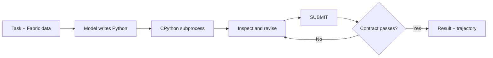
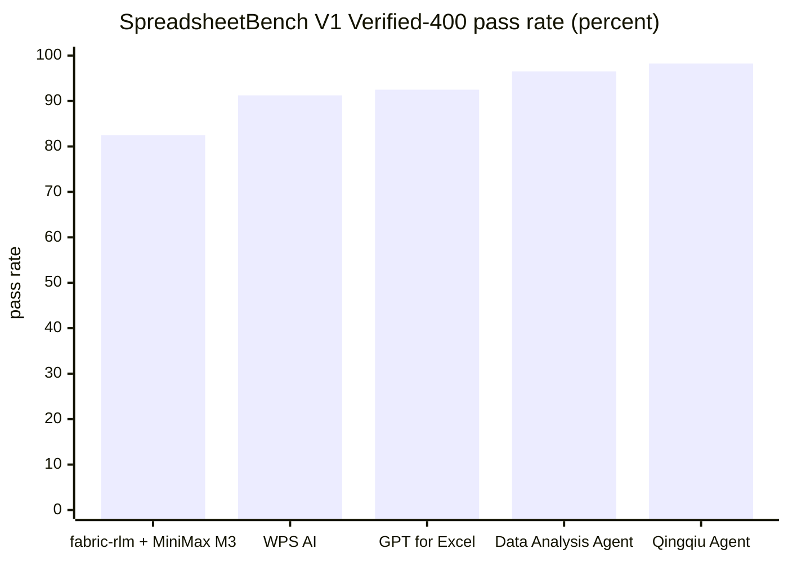

# Detailed Usage Guide

For an overview, see the [front page](../README.md). See also the
[API reference](api-reference.md) and [Skills Guide](skills-guide.md).

[](https://github.com/pawarbi/fabric-rlm-core/actions/workflows/test.yml)
[](https://pypi.org/project/fabric-rlm/)
[](https://pypi.org/project/fabric-rlm/)
[](../LICENSE)


Run verifiable data tasks inside Microsoft Fabric.

`fabric-rlm` gives a model a Python workspace next to your Fabric data. It can
read Lakehouse files, analyze Delta tables, query Power BI semantic models,
calculate results, and write new artifacts. Output contracts and validators
decide whether the work is accepted. Failed checks go back into the run for
another attempt.

For read-only analytical questions, [`verified_task`](verified-task.md)
can compare two independent solves and optionally use a different model to
reconcile disagreement. Agreement is not a correctness guarantee.

The [API reference](api-reference.md) explains every argument, its default,
when to use it, and engine-specific limits. See the
[argument test matrix](api-argument-tests.md) for data-backed verification
and remaining environment-specific gaps.

The runtime uses a CPython subprocess inside the notebook session. pandas,
DuckDB, Polars, openpyxl, PyMuPDF, and other installed packages remain
available. Large files stay on disk. The model sees previews, summaries, and
computed results rather than every raw byte.

## Quick start in Fabric

Install `fabric-rlm` in a Fabric notebook. The Python notebook experience is
recommended for this example.

```python
%pip install "fabric-rlm[analytics]"
```

After installation, restart the session. The example below uses the roughly
140 MB, 1.57-million-row IMF CSV created by the
[flagship notebook](../examples/notebooks/rlm_vs_plain_llm_imf_cpi.ipynb). You can
replace it with another large CSV in Lakehouse Files.

```python
from fabric_rlm import FabricLM, File, RLM

result = RLM.task(
    task="""
    Analyze the complete IMF price dataset. Inspect its schema and confirm the
    dimensions used. Select the monthly, all-items, year-over-year CPI series:
    INDEX_TYPE='CPI', COICOP_1999='_T',
    TYPE_OF_TRANSFORMATION='YOY_PCH_PA_PT', and FREQUENCY='M'. For the latest
    complete year, calculate average inflation by country and return the 10
    countries with the highest average. Report the matched row count, source
    columns, and filters applied.
    """,
    inputs={
        "prices": File("/lakehouse/default/Files/imf_cpi.csv"),
    },
    outputs={
        "year": int,
        "top_countries": list,
        "rows_analyzed": int,
        "source_columns": list,
        "filters_applied": list,
    },
    lm=FabricLM("gpt-5.1"),
    skills=["data_exploration"],
    max_turns=8,
).run()

if not result.submitted or result.failure_reason is not None:
    raise RuntimeError(result.failure_reason or "No accepted answer")

print(result.top_countries)
print(result.filters_applied)
```

`FabricLM` uses the model endpoint available to the Fabric capacity. The
notebook identity supplies authentication. There is no API key to place in the
notebook and no separate Azure OpenAI resource to configure. You can see the list of supported models [here](https://learn.microsoft.com/en-us/fabric/data-science/ai-services/ai-services-overview#consumption-rate-for-openai-language-models).
You can also use models from OpenAI, Anthropic, Foundry, and OpenRouter through
LiteLLM.

### Why this works beyond the context window

A CSV with 1.57 million rows cannot be placed in a model prompt. The `File`
input passes its Lakehouse path into the Python worker instead. The model can
write DuckDB, Polars, or pandas code to inspect the schema, filter rows, and
calculate aggregates. Files are not automatically embedded in the prompt.
Execution feedback is size-bounded, not content-redacted: generated code can
print raw source rows, and that output can reach the configured model provider.
Choose appropriate sources, permissions, and provider data-handling policies.

This pattern also works with wide Excel workbooks, Parquet files, JSONL
streams, PDFs, and combinations of those sources. File size is constrained by
the libraries and compute available in the notebook session rather than the
model's context window.

## What happens during a run

1. You provide a task, named inputs, and an output contract.
2. The model writes Python for the task.
3. The Python runs in a persistent subprocess with access to mounted Lakehouse
   files and installed packages.
4. Execution output returns to the model. It can inspect results and revise the
   code.
5. The run calls `SUBMIT(...)`.
6. Type checks, skill verifiers, and your validators inspect the submission.
7. A rejected submission returns with specific repair feedback.
8. An accepted submission becomes an `RLMResult` with the payload and full
   trajectory.



## Why Fabric developers use it

### Work with Fabric data in place

Bind individual Lakehouse files with `File(...)`, discover Delta tables and
Files with `LakehouseSource(...)`, publish generated files with
`FileDestination(...)`, or connect Power BI semantic models with
`SemanticModel(...)`. A single task can combine these handles. DAX runs in the
tabular engine, Delta reads honor the transaction log, file processing runs in
Python, and generated artifacts can be written back to `Files/` without giving
the isolated worker OneLake credentials.

For parent-notebook calls where SemPy's automatic token service is unavailable,
opt into refreshable user-identity authentication:

```python
model = SemanticModel(
    "<semantic-model-id>",
    workspace="<workspace-id>",
    credential_provider="notebookutils",
)
```

This calls `notebookutils.credentials.getToken("pbi")` in the parent process.
Neither the token nor the `credential_provider` setting is serialized into a
task-bound worker handle. Ordinary worker-side semantic-model queries still
require working SemPy automatic authentication. Use parent-side registered
operations or trusted host tools for this credential-provider path; successful
parent access alone does not establish that worker queries will authenticate.

Learn a reusable, source-bound package when the same approved sources support
multiple tasks:

```python
from fabric_rlm import FabricLM, File, RLM, load_knowledge

knowledge = RLM.learn(
    sources={
        "orders": File("/lakehouse/default/Files/orders.parquet"),
    },
    store="/lakehouse/default/Files/knowledge/sales.json",
)

result = RLM.task(
    "Revenue by region for the latest complete month",
    knowledge=knowledge,
    outputs=["answer"],
    lm=FabricLM("gpt-5.1"),
).run()

knowledge = load_knowledge(
    "/lakehouse/default/Files/knowledge/sales.json",
    sources={
        "orders": File("/lakehouse/default/Files/orders.parquet"),
    },
)
```

`RLM.learn(...)` deterministically profiles bounded source metadata, keeps
runtime paths and authorization handles outside the persisted package, and can
save locally, to the attached Lakehouse mount (`/lakehouse/default/Files/...`),
or to a canonical OneLake `abfss://.../Files/...` path. A saved package is never
replaced unless you pass `overwrite=True`.

Two budgets in `ProfileLimits` apply to a file source. `max_input_bytes`
(1 MiB) bounds what the profiler parses to infer a schema. `max_snapshot_bytes`
(512 MiB) bounds what is hashed to detect change; hashing streams, so a file
within it is verified exactly whatever its size. A larger file is hashed at its
head and tail only. `RLM.learn` warns about such a source, no operation is
registered for it, and a task given that knowledge refuses it with a message
that says so. Raise the budget where that is acceptable:

```python
from fabric_rlm import ProfileLimits

knowledge = RLM.learn(
    sources={"orders": File("/lakehouse/default/Files/orders.parquet")},
    limits=ProfileLimits(max_snapshot_bytes=4 * 1024**3),
)
```

Pass the same `limits` to `load_knowledge`. A semantic model with thousands of
measures keeps as many tables, columns and measures as fit in
`max_diagnostic_bytes`; its fingerprints still cover the complete metadata, so
change detection is unaffected and only the registered operation's allowlist is
shorter (`retained_record_cap` in the profile diagnostics says by how much). Loading
requires fresh, exact source aliases and rejects source drift before binding.
Every knowledge-enabled task preflights the current sources before the model is
called. For a `SemanticModel`, learning also registers one bounded
`semantic_model.measure.v1` capability from visible measures and columns. The
RLM may select that operation through a strict scalar JSON plan; the host
validates the allowlisted measure, group-by, and up to three filters, executes
`SemanticModel.measure(...)`, audits row/column/byte bounds, and gives the model
only the compact fingerprinted result packet for synthesis. The model never
supplies arbitrary DAX. CSV, Parquet, and Delta profiles also register a
compiler-owned `tabular.aggregate.v1` operation. Exact Lakehouse Delta catalogs
register bounded aggregate operations, plus a two-fact operation that
pre-aggregates each fact at the shared key grain before joining. The model
selects only typed scalar parameters; it never supplies SQL or file-reader
expressions. Inexact Lakehouse file catalogs and stale source snapshots fail
closed rather than entering registered execution.

### Deterministic reports and briefs

These tools operate on the source itself:
`fabric_rlm.reports.report` takes a lakehouse or a semantic model and a
question in plain words ("trend of revenue by product category", "why did
reseller sales fall in December 2013 by territory", "top movers by customer
year over year", "weekly recap", "what changed in July 2025 for product xyz
and was it in line with the trend"), reads it against the source's own
vocabulary (the kind of report; the measure; the groupings after "by",
"per" or "which"; the periods; a filter on any value the source holds,
looked up before it is applied and pushed into every query: "for tiktok",
"where customer state = SP", "for the Night shift"; and a check of the
named month against the trend and season of each measure when the question
asks whether it was in line), measures every figure with the source's
engine (SQL over OneLake, DAX for a model), recomputes each reported figure
with an independent query, and renders a dashboard with trend, waterfall
and driver scatter charts. This is a deterministic reporting utility, not an
RLM execution loop; its budget counts sweep queries rather than model turns. The
page lists how the question was read, the filter with its row count, and
the words that named nothing; a value that matches nothing or too many
things is said, not silently widened. No model touches the numbers. `fabric_rlm.brief.brief(source, ["revenue by region",
"orders"])` is the Monday Morning Brief: last week for the metrics you name,
against the week before, the same week last year, the recent averages and
the seasonal expectation, with level shifts, the drivers of the move, the
volume and rate split, the day-of-week pattern and what moved together.
`kpis=["new customers", "churned customers over 4 weeks", "average order
value = sales amount / order quantity", "top 3 share of revenue by
reseller"]` adds KPIs built from the source's structure: the entity is
discovered and its choice explained, and every definition is printed next
to its number.

The library also retains `fabric_rlm.experimental.data_agent_review` as an
experimental module, not a public notebook recipe. Reports, briefs and KPIs
do not depend on it; source modelling lives in `fabric_rlm.source_model`.

### Learn from earlier runs

A package can also carry what earlier runs learned about a source. Every turn
records its source calls as typed telemetry (the grain a semantic-model query
or a Lakehouse query asked for, the estimated group count, whether it ran, was
rejected or timed out, how long it took, which measures came back identical)
and never the data values; a registered operation the host executed for the
run is recorded the same way, so CSV, Parquet, Delta and Lakehouse sources learn
from their operations as semantic models learn from worker queries. Declared
facts (grain, period column, units, definitions) are lessons from the start
and reach every task on the source. `capture_evidence=True` turns that telemetry, together with what actually
checked the run's answer (a validator or skill verifier that executed and
accepted it, never configuration alone) and the analytical-integrity
status, into `result.evidence`;
`RLM.enrich` promotes evidence into structured lessons by a per-kind policy and
returns a new package without touching the saved one. Evidence keeps the
schema fingerprints the run executed against; a record that does not match
the package it is enriched into is dropped and noted as an event, never
relabelled:

```python
knowledge = RLM.learn(
    sources={"production": "production.csv"},
    store=store,
    # what the profile cannot infer, stated by the source owner
    declared={
        "production": {
            "grain": ["line_id", "reporting_period"],
            "period_column": "reporting_period",
            "units": {"produced_units": "units"},
            "definitions": {"reporting_complete": "the row is final; exclude incomplete rows from totals"},
        }
    },
)

result = RLM.task(question, knowledge=knowledge, lm=lm, capture_evidence=True).run()
knowledge = RLM.enrich(knowledge, [result], store=store, overwrite=True)

for lesson in knowledge.package.lessons:
    print(lesson.kind, lesson.status, lesson.confidence, lesson.subject)
```

Lesson kinds include `time_semantics` (a boolean current-period flag in a
period-like table of a semantic model is active from `learn()` on, labelled
as inferred from schema names; a name match alone in such a table is only a
candidate, and "current" elsewhere in the schema produces nothing),
`context_requirement` (a derived measure that collapsed to its base measure
under an unfiltered context; it stays a candidate, however often that
recurs, until the same pair is compared under a period filter or a period
grouping and comes out distinct), `expensive_grain` (proved by a cardinality
preflight at once, by timeouts only in two separate runs), `valid_grain` (a
grain that executed and returned rows in two separate runs, rendered as an
observed feasible query grain; verified runs raise its confidence),
`preferred_strategy` (only when the trajectory shows a
`restrict_to_candidate_tuples` step between the coarse and the fine query, in
runs whose answer passed an actual verifier and the integrity screen),
`invalid_path`, and `query_behavior` for two measures whose values coincided
across filtered contexts, recorded with `semantic_equivalence: false`: equal
values never promote a `metric_equivalence` lesson. Candidates are never
shown to the model. When a task falls through to the live source, the active
lessons relevant to it are rendered into a short "Learned source guidance"
section after the inputs, each line tagged with the source it was learned on;
the registered-operation planner sees only the lessons for the sources its
operations read. The source stays bound, so learning narrows the search and
never removes the cold path. A package with no evidence and no lessons
serializes exactly as before. Each lesson carries a dependency scope: a
schema change stales the schema-scoped lessons that depend on the changed
source, and a data-only change stales the snapshot- and operational-scoped
ones (grains, costs, strategies) while leaving the schema facts. Today the
typed source-call telemetry that feeds richer lessons comes from
`SemanticModel` (and Lakehouse SQL timings); file sources contribute run
outcomes only, so the behavioural learner is not yet equally deep across
source types.

The development notebook
`benchmarks/notebooks/rlm_knowledge_benchmark_matrix.py` runs seeded,
cache-disabled cold-versus-learned trials across these paths and records
correctness, operation selection, audit status, turns, token usage, LM/worker/
host/wall time, provenance, and drift rejection. `KnowledgeBenchmarkReport`
also records source calls, failed calls, source seconds, the first useful
query turn, verifier repairs, integrity status and injected lessons, and
`cold_parity()` states the release rule: learned correctness must not fall
below cold, overall and on every task.

```python
from fabric_rlm import FabricLM, FileDestination, LakehouseSource, RLM

lakehouse = LakehouseSource(
    "abfss://<workspace-id>@onelake.dfs.fabric.microsoft.com/<lakehouse-id>"
)

with FileDestination(
    "abfss://<workspace-id>@onelake.dfs.fabric.microsoft.com/"
    "<lakehouse-id>/Files/reports"
) as destination:
    result = RLM.task(
        task=(
            "Create a formatted revenue workbook. Save it to a staged file, "
            "verify it by reopening it, then publish it through destination."
        ),
        inputs={"lakehouse": lakehouse, "destination": destination},
        outputs={"workbook_path": str, "summary": dict, "sources_used": list},
        skills=["excel_modify", "delta_lakehouse"],
        lm=FabricLM("gpt-5.1"),
    ).run()
```

Worker code uses `destination.stage("revenue.xlsx")` for the local openpyxl
path and `destination.publish(staged)` after verification. The trusted parent
performs the final copy and returns a manifest containing `path`, `name`, and
`size`. Publishing refuses path traversal, files outside the private staging
area, oversized files, and accidental overwrites. The context manager removes
local staging files whether the run succeeds or fails. Pass
`overwrite=True` to `destination.publish(...)` only when replacing an existing
OneLake file is intentional.

### Use the Python packages already in the notebook

The subprocess runs the same Python environment as the notebook. Generated code
can import native packages and work with real file paths. This is the main
difference from the Deno and Pyodide interpreter used by DSPy's standard RLM.

### Check the work before accepting it

Output mappings enforce runtime types. `output_validator` can enforce business
rules. `output_validator_context` can inspect files and other side effects.
Markdown skills can include their own verifier. A failed check becomes feedback
for the next attempt.

### Check what a workbook's formulas evaluate to

openpyxl stores a formula as text and never evaluates it, and a workbook saved
from Python has no cached values. Reopening the file can confirm that a cell
holds a formula, not that the formula is right. For a what-if model or a
dashboard whose cells must be formulas, recalculate the saved file in the
validator (`pip install fabric-rlm[excel]`):

```python
from fabric_rlm import RLM, workbook_formula_validator

validator = workbook_formula_validator([
    {"inputs": {}, "expected": {"Scenarios!G3": 548_349.0}},
    {"inputs": {"Assumptions!B9": 0.8}, "expected": {"Scenarios!G3": 1_693_384.0}},
])

result = RLM.task(task, inputs=inputs, outputs={"report_path": str},
                  output_validator=validator, lm=lm).run()
```

Each scenario writes its input cells into a copy of the workbook, recalculates,
and compares. A wrong cell comes back to the run as repair feedback that names
the cell, what it recalculated to and what was expected. Give at least two
scenarios with different inputs: hard-coded numbers can satisfy one, not both.
`recalculate_workbook(path, inputs)` and `formula_errors(path)` are the same
machinery for use in your own checks. The engine covers ordinary arithmetic and
functions such as SUM, IF, SUMIFS, COUNTIFS, INDEX, MATCH and IFERROR; dynamic
array functions are not supported.

### Keep domain rules beside the data

Skills are Markdown playbooks. They capture field definitions, procedures,
tripwires, and executable checks. Store custom skills in Lakehouse Files and
load them with `SkillLoader`. Bundled and custom skills can be used together.

### Inspect each run

`RLMResult` includes the submitted payload, executed turns, errors, timings,
token usage, validation repairs, and a deterministic report. Trajectories can be
saved and replayed without calling the model again.

## Where it fits

Use `fabric-rlm` for tasks that need one or more of these:

- Data that is too large to place in a model prompt
- Exact calculation across many rows or files
- Power BI semantic model queries mixed with Lakehouse files
- Workbook, report, or document generation
- Multi-step analysis with checkable outputs
- Reusable domain instructions and validation rules
- An execution trail for debugging and review

A direct model call is usually a better choice for short questions, rewriting,
or judgment over text that already fits in context. The runtime adds Python
execution and iterative checks, so each run takes longer than a single call.

## Start with the API tour

Import
[examples/notebooks/rlm_api_tour.ipynb](../examples/notebooks/rlm_api_tour.ipynb)
into a Fabric workspace. It covers task construction, typed outputs, files,
custom Lakehouse skills, validators, result inspection, and worker controls.

The other notebooks cover PDF work, Spark log analysis, spreadsheet editing,
semantic models, and multi-source tasks.

## Measured results

The benchmarks are included for readers who want the evaluation setup, costs,
and caveats. They are not required to use the library.

<details>
<summary><strong>Open benchmark results and reproducibility notes</strong></summary>

### Large-file workbook comparison

One task, two attempts. The task: from a 140 MB IMF CPI pull (1.5 million rows,
194 countries, fetched live from the public SDMX API), build a formatted Excel
report: a pivot of the 10 highest-inflation countries by year, a merged title
cell, styled headers, and a second sheet listing every qualifying country.

The first attempt gives gpt-5.1 the question plus as much raw CSV as
fits in a prompt. The second gives gpt-5-mini, about 5x cheaper, the same
question through the RLM. Measured result:

| run | result | workbook | tokens | cost | seconds |
|---|---|---|---|---|---|
| plain call, gpt-5.1 | failed | none | 109,480 | $0.138 | 8.4 |
| RLM, gpt-5-mini | passed | correct, verified | 47,642 | $0.023 | 78.4 |

gpt-5.1 burned 109K tokens discovering the data was never in its context.
The mini model wrote DuckDB and openpyxl code in the subprocess, built the
workbook, and a deterministic ground-truth query verified every cell. The
failed call cost six times more than the successful one. The notebook then
pushes the same mini model through a harder task (finding inflation streaks
with tie-breaks, conditional formatting, and an embedded chart, cleared for
about two cents), runs an honest skill ablation, and finishes with the
two-source task. Run it yourself:
[examples/notebooks/rlm_vs_plain_llm_imf_cpi.ipynb](../examples/notebooks/rlm_vs_plain_llm_imf_cpi.ipynb).

### SpreadsheetBench Verified-400

[SpreadsheetBench](https://github.com/RUCKBReasoning/SpreadsheetBench-2) tests
whether an agent can carry out real spreadsheet-manipulation instructions,
graded cell-exactly against golden workbooks. On the full Version 1
Verified-400 set (all 400 questions, single attempt each, temperature 1.0,
fabric-rlm 0.2.8 with the `excel_modify` skill and workbook structure context,
model served from MiniMax's first-party endpoint):

| system | model | pass rate | model spend |
|---|---|---|---|
| fabric-rlm | MiniMax M3 (open weights, $0.30/M in, $1.20/M out) | **82.5%** (330/400) | $2.61 total, $0.0065 per question |

That 82.5 percent is the score reported by the benchmark's own
`evaluation.py`, run unmodified over our output workbooks, so it is measured the
same way as every figure below. It is self-reported in the sense that we ran the
script ourselves; an official submission is planned.

For context, the top of the public V1-Verified (400) leaderboard is held by
commercial spreadsheet products: Qingqiu Agent at 98.25, ByteDance's Data
Analysis Agent at 96.5, GPT for Excel at 92.5, WPS AI at 91.25. Ours comes from
an open-source library driving a cheap open-weight model, at a cost of well
under a cent per task.



For scale, two vendors publish a result for Claude Opus 4.6 driven by a bare
prompt with no agent loop: 321/400 = 80.2 percent
([DealGlass results repo](https://github.com/arthursolwayne/spreadsheet-agents))
and 80.25 percent (Leni). Opus 4.6 tokens are priced roughly 17 times higher on
input and 21 times higher on output than MiniMax M3. So an open-source runtime
driving an open-weight model with a spreadsheet skill scores slightly above a
frontier model asked directly, at a small fraction of the per-token price. Two
caveats worth stating plainly: that comparison is against a single-shot prompt,
and the same Opus 4.6 inside a purpose-built scaffold reaches 95.2 percent, so the
honest reading is that scaffolding matters more than model choice, not that one
model beats another. All three figures are self-reported.

Reproduce it with
[benchmarks/notebooks/ssb400_minimax_m3_fabric_repro.ipynb](../benchmarks/notebooks/ssb400_minimax_m3_fabric_repro.ipynb);
the run needs an OpenRouter key and costs a few dollars.

### AIDABench

SpreadsheetBench hands you one workbook and tells you which cells to fill.
[AIDABench](https://arxiv.org/abs/2603.15636) is closer to real analyst work: read
one or more source files, decide the shape of the answer yourself, and write a new
file. 41 percent of its file-generation tasks span multiple inputs, up to 13 in a
single task, and the target range is never given.

Same library, same MiniMax M3, no per-benchmark tuning:

| split | fabric-rlm + MiniMax M3 | best in the paper | cost per task |
|---|---|---|---|
| File generation (261 tasks) | ~42% | 49.4% (Claude Sonnet 4.5) | $0.023 vs $0.237 |
| Question answering (226 tasks) | 63.6% | 68.6% (Claude Sonnet 4.5) | $0.012 vs $0.122 |


That is five to seven points behind the leading model at roughly a tenth of the
cost on both splits, which puts it mid-table against the eleven models in the
paper. The cost figures price identical token usage at each model's published
rate, so they compare workloads rather than observed spend.

The third split, data visualization, was not run. Its deliverable is a chart image
graded on presentation rubrics, which needs a vision-capable judge and
chart-construction guidance this library does not ship.

File-generation scores were checked against AIDABench's own evaluator, run
unmodified, on a 62-task sample: 41.9 percent against our judge's 43.5 percent. QA
was graded with their `eval_QA.py` under two different grader models, which agreed
on 94.6 percent of answers.

The runners, both graders, every trajectory, the grader calibration, and an
account of the seven grading bugs found along the way are in
[pawarbi/fabric-rlm-benchmarks](https://github.com/pawarbi/fabric-rlm-benchmarks).
These are single-seed numbers. Two identical runs agreed on 84 percent of tasks,
so treat differences under about ten points as noise.

</details>

## Fabric data sources

Fabric notebooks already provide mounted Lakehouse storage, `sempy`, notebook
identity, and the Python analytics stack. `fabric-rlm` exposes those resources
to the run through typed handles. The task can combine semantic model queries
with CSV, PDF, Excel, Parquet, and JSONL files without building a separate
ingestion path.

<picture>
  <source media="(prefers-color-scheme: dark)" srcset="assets/multisource-dark.svg">
  
</picture>

Every source is bound as an input and the model decides which one answers which
part of the brief. The semantic models are queried with DAX in the tabular
engine, so aggregation happens where the data is and only the result comes
back. The files are read in the subprocess. The workbook is written straight to
`Files/`.


## Installation

Python 3.10 to 3.12 is required; 3.13 is not supported yet. In Fabric, select the Python 3.12
(`jupyter_python`) kernel. Install the package and restart the session:

```python
%pip install fabric-rlm
```

If imports fail on the Synapse PySpark kernel, see
[docs/fabric-runtime-deps.md](fabric-runtime-deps.md).

Optional extras install packages used by specific workloads:

| Extra | Adds | Use it for |
|---|---|---|
| `fabric-rlm[pdf]` | PyMuPDF | PDF analysis and extraction |
| `fabric-rlm[analytics]` | DuckDB, Polars | Large CSV, Parquet, and JSONL analysis |
| `fabric-rlm[excel]` | openpyxl, formulas | Recalculating a saved workbook to check its formulas |
| `fabric-rlm[fabric]` | SynapseML | Fabric model integration when the runtime does not provide it |
| `fabric-rlm[dev]` | pytest and development tools | Local development |

## Other Python environments

The runtime also works on a laptop, in CI, or in an Azure Function. Use
`OpenAILM` or `AnthropicLM` with the matching environment variable:

```python
from fabric_rlm import File, OpenAILM, RLM  # set OPENAI_API_KEY in your environment

rlm = RLM.task(
    task="Sum every integer from 1 to 1,000,000 that is divisible by 3 or 5.",
    outputs=["answer"],
    lm=OpenAILM("gpt-4o-mini"),
)
print(rlm.run().answer)
```

`RLM.task(...)` is the short constructor; `RLM.from_task(...)` is the explicit
form. `OpenAILM`, `AnthropicLM`, and `FabricLM` are thin wrappers over `dspy.LM`,
so any OpenAI, Anthropic, Azure, or local Ollama model works.

Use a mapping when an output needs a runtime type contract:

```python
result = RLM.task(
    task="Return the highest-revenue region and its revenue.",
    inputs={"sales": File("sales.csv")},
    outputs={"result": dict},
    lm=OpenAILM("gpt-4o-mini"),
).run()
```

If `SUBMIT(result=...)` receives the wrong type, the submission is rejected and
the model gets repair feedback. Name-only lists such as `outputs=["answer"]`
remain supported and do not add type enforcement.

## Inputs and worker API

### Values and files

Bind values, including large files, as inputs. Files arrive
inside the worker as `File(...)` handles with `.path`, `.read_text()`,
`.read_bytes()`, and `.exists()`, so a Lakehouse path or a local path is just a
file path.

### Lakehouses

`LakehouseSource` builds a metadata catalog in the parent Fabric notebook, then
passes that catalog and the direct OneLake paths to the isolated worker. The
model can choose relevant Delta tables and Files without you naming each table:

```python
from fabric_rlm import FabricLM, LakehouseSource, RLM

source = LakehouseSource(
    "abfss://workspace-id@onelake.dfs.fabric.microsoft.com/lakehouse-id",
    tables="Tables",
    files="Files/data",
)

result = RLM.task(
    task="Which customer segments have declining usage and rising support demand?",
    inputs={"lakehouse": source},
    outputs={"answer": dict, "sources_used": list},
    lm=FabricLM("gpt-5.1"),
).run()
```

The root may use workspace and Lakehouse names or GUIDs. You can also pass a
path ending in `/Tables`, `/Tables/<schema>`,
`/Tables/<schema>/<table>`, or `/Files/<path>` to narrow discovery. Multiple
`LakehouseSource` objects can be nested in input lists or dictionaries.
Automatic Delta schema discovery requires `fabric-rlm[analytics]`. Outside a
Fabric notebook, or when you already maintain a catalog, pass `catalog=[...]`
to bypass discovery.

Inside the worker, use the resolved catalog helpers instead of trying to call
Fabric discovery APIs again:

```python
lakehouse.list_sources(kind="delta")
lakehouse.find_sources("usage")
lakehouse.find_sources("customer_id", kind="delta")

summary = lakehouse.query(
    """
    SELECT c.region, SUM(s.mrr) AS active_mrr
    FROM companies AS c
    JOIN subscriptions AS s USING (company_id)
    WHERE s.status = 'active'
    GROUP BY c.region
    ORDER BY active_mrr DESC
    """,
    sources={
        "companies": "dbo.companies",
        "subscriptions": "dbo.subscriptions",
    },
)
```

To give a task some tables and not others (a table with personal data, or a
lakehouse with hundreds of tables), list them on one handle. `tables=` takes a
sequence:

```python
source = LakehouseSource(
    "abfss://workspace-id@onelake.dfs.fabric.microsoft.com/lakehouse-id",
    tables=["Tables/dbo/fact_policy_month", "Tables/dbo/dim_product"],
)
```

A query can only join sources that belong to the same handle. Several
`LakehouseSource` objects can be bound in one task, but tables bound as separate
handles cannot be joined to each other, so keep tables that belong together on
one handle. Lakehouses with and without schemas (`Tables/dbo/<table>` and
`Tables/<table>`) are both discovered.

A table folder that cannot be read, for example one a failed write left with an
empty `_delta_log`, is left out of the catalog and listed in `source.skipped`
with the reason. The task is told which folders were skipped. Discovery fails
only when the scope is that one table, or when nothing in the scope is readable.

Catalog searches match source names, paths, columns, and data types. They do
not widen the Tables or Files scopes supplied by the caller. `query()` runs in
the trusted parent process against only the named catalog entries and returns
bounded JSON-safe rows, so Fabric storage credentials are never exposed to the
isolated model-generated worker. Queries are parsed before execution: every
relation must resolve to a supplied alias or a CTE derived from one, and
user-authored table functions, dynamic SQL, external paths, and unrecognized or
side-effecting functions fail closed. The parent also applies a 30-second
deadline, a 256 MiB DuckDB memory limit with temporary spill disabled, a
10,000-row ceiling, and a 5 MiB serialized-result ceiling. Results are fetched
and sized one row at a time so an oversized scalar or row is rejected before
the complete result is materialized.

`query()` returns at most `max_rows` rows (1,000 by default) and sets
`"truncated": True` when it cut the result. The SQL itself always reads the whole
table, so an aggregate is exact; only a query that returns many rows is cut.
Called from a notebook cell, a truncated result raises a `UserWarning`. Inside a
run it prints a warning into the turn's output, and the
analytical-integrity screen sends back a submission whose last read of a source
was truncated, because figures computed from the first rows alone are wrong.

### Semantic models

A Power BI semantic model binds the same way and arrives as a connected handle:

```python
from fabric_rlm import FabricLM, RLM, SemanticModel

RLM.task(
    task="Which product line has the highest recurring revenue?",
    inputs={"arr": SemanticModel("ARR Model SF (79)")},
    outputs=["answer"],
    lm=FabricLM("gpt-5.1"),
).run()
```

Inside the run, `arr.schema()` returns formatted schema text. For programmatic
inspection, `arr.metadata()` returns ordinary pandas DataFrames with stable
snake-case columns for tables, columns, measures, and relationships.
`arr.dax("EVALUATE ...", normalize_columns=True)` returns an ordinary pandas
DataFrame with predictable names such as `period_year` and `arr`, avoiding
SemPy's bracketed result-column conventions. The raw metadata methods and raw
`arr.dax("EVALUATE ...")` behavior remain available. `arr.measure(name,
groupby=[...], filters={...})` evaluates a model measure without authoring DAX.
Pass `workspace=` for a model outside the attached workspace.

For measures by dimensions, prefer `arr.aggregate(...)`. It validates measure
and column names against the model, estimates how many groups the request
would produce, and refuses to run a query whose estimate exceeds the safe
limit (10,000 groups by default) or cannot be produced within thirty seconds. The
error names the grouping, the measures, and concrete ways to narrow the query,
so the model recovers in one turn instead of waiting out the worker timeout.

```python
arr.aggregate(
    measures=["ARR $", "New $"],
    groupby=["Products[Line Of Business]", "Sold To[Sold_To Region]"],
    filters={"Period[YearQuarter]": "2026/Q2"},
    order_by="ARR $",
    top=100,
)
```

`SemanticModel("...", max_groups=50_000)` or `FABRIC_RLM_SEMANTIC_MAX_GROUPS`
raises the ceiling for a model that handles wide grains well, and
`FABRIC_RLM_SEMANTIC_PREFLIGHT_TIMEOUT` adjusts the estimate budget in seconds.
`arr.query_telemetry` records the estimate, timing, and outcome of each call.
`arr.dax(...)` is unchanged and runs whatever it is given.

`order_by` names one requested measure or groupby column. Besides a string it
accepts the forms generated code tends to write: `("ARR $", "desc")`,
`["ARR $"]` and `[("ARR $", "desc")]`. Several sort keys are refused with a
message that shows the accepted form.

A measure the engine types as variant (a SWITCH over numbers and text, a
calculation group) is serialized by SemPy as text. `aggregate()`, `measure()` and
the expression columns of `dax()` give such columns their numeric dtype back
when every value is a plainly written number, so `sort_values` and `sum` behave.
Model columns (`Table[Column]`) are never converted.

SemPy's measure endpoint rejects some valid groupings, for example a column on
a fact table. `arr.measure(...)` then answers the same request through the DAX
path that `aggregate()` uses and returns it in its usual shape.

Bind several at once and the model routes between them:

```python
inputs={
    "mfg": SemanticModel("Manufacturing Ops"),
    "arr": SemanticModel("ARR Model SF (79)"),
}
```

This needs a Fabric notebook, where `sempy` ships in the runtime. The dataset
name is checked when you construct `SemanticModel`, so a typo fails on that
line rather than several turns into a run.

The handle gives generated code a clear entry point. Across two semantic models
and two model families, tasks scored 18-19/19 and 13/15 with the handle. The
same tasks scored 7/19 and 5/15 when they only named the semantic model.

#### The latest period and the headline numbers

On a model a run has not seen before, the most common way a report goes wrong is its headline period. Real examples include a last month with nine days of data, forward-dated rows years ahead, and a January-to-May "year". `period_coverage` measures this instead of leaving it to judgement:

```python
print(arr.period_coverage("ARR $"))                 # by month
print(arr.period_coverage("ARR $", grain="year"))
```

It prints the date column it used and why, the dates with data in each period against the typical earlier period, a status per period (complete, partial, in progress, future, empty, low coverage), and the latest complete period. It also lists any measure that looks like the model's own as-of date, without applying it. Pass `as_of=` to use one. A weekday-only business and a model with one row per month are not treated as partial.

To enforce it, and to recompute the headline numbers, add the checks to the run:

```python
from fabric_rlm import semantic_model_checks

model = SemanticModel("Sales Model")
checks = semantic_model_checks(model, name="model")
RLM.task(
    task=my_task + "\n\n" + checks.instructions,
    inputs={"model": model},
    outputs={**my_outputs, **checks.outputs},
    output_validator=checks,
    lm=FabricLM("gpt-5.1"),
).run()
```

When the run submits:

- A headline period that is partial, in progress or in the future goes back for repair, unless the run labels it period-to-date.
- Each claim is recomputed with DAX the harness writes itself. A claim is a measure, an aggregate over a column, or a ratio of two, with filters and a period. A number whose own query dropped a filter is caught this way, which re-running that query cannot do.

The validator allows three rejections per run by default (`max_rejections`) and records every check in `checks.log`.

### Analytical integrity

The same rules apply whether a number came from a `File`, a `LakehouseSource`,
or a `SemanticModel`. Three helpers are predefined in the sandbox and exported
from `fabric_rlm`:

```python
is_material_change(current, baseline, absolute_tolerance=1000, direction="decrease")
restrict_to_candidate_tuples(history, candidates, keys=["product", "region", "group"])
validate_analysis_integrity(ranking={...}, requested_grain=[...], actual_grain=[...], claims=[...])
```

`is_material_change` never treats float noise as a trend and carries no
business threshold of its own; the analysis states the rule. The tuple helper
keeps multidimensional candidates as compound identities instead of independent
per-dimension lists. `validate_analysis_integrity` runs whichever checks have
inputs: ranking concept versus metric, grain, materiality, candidate identity,
provenance, and cross-source period, unit, definition, entity, and
contradiction reconciliation.

Before accepting a `SUBMIT`, the runtime also screens the answer: prose that
contradicts its own numbers, a "rank by impact" task whose ranking that reaches
the answer sorted by something else or whose written answer hides the impact
metric (with no prose in the payload, only an explicit "rank by" or "prioritize
by" is screened: "sorted by" and "top N by" are the layout of a table),
and code that consumed independent per-dimension value lists from a candidate
frame together (a cartesian filter, whether as `.isin` chains or
`aggregate(filters=...)`) without restoring the compound identity on those
dimensions afterwards, are sent back with the reason. So is a submission that
returns a file path the task supplied when no file exists there, which is what a
run looks like when every attempt to build the workbook failed before the save.
A workbook, Word or PowerPoint file, or Parquet file that the run wrote and that
no longer opens is sent back too, whether its path is in the payload or was only
an input: openpyxl, python-docx and pyarrow write straight to the destination,
so a save that raises partway leaves a cut-short file behind. A file that was
there before the run started, a `File` input and a remote URL are never judged.
So, once, is a zero or an empty result that was computed and submitted in the
same step: output reaches the model only after a step ends, so that value was
never looked at, and zero is also what a filter that matched nothing or an
`except` that skipped every row looks like. A true zero costs one confirming
step, and the check stays silent on a run's last turn.
The code detectors are
high-confidence and best-effort: they read pandas, polars, pyspark, `sorted`
and SQL `ORDER BY` spellings and follow variable lineage from `SUBMIT`, and
they stay silent when they cannot tell. In the default `"repair"` mode this happens at
most twice, then the answer is accepted and the findings are exposed as
`result.integrity_problems` with `result.integrity_ok` false. In `"strict"`
mode a submission with findings is never accepted. Pass
`analytical_integrity=False` or set `FABRIC_RLM_ANALYTICAL_INTEGRITY=0` to turn
the screen off.

Cross-source reconciliation (entities, metric definitions, periods, units,
contradictions) is not enforced automatically, because the runtime has no
structured claims to check. It is available three ways: as guidance the prompt
injects whenever two or more evidence inputs are bound, in the
`analytical_integrity` skill, and as `validate_evidence_lineage` /
`validate_analysis_integrity(claims=...)` for an analysis that declares its
claims, sources, joins, and disclosures.

### Submission contract

The runtime injects `SUBMIT(...)`. Call it with keyword arguments matching the
declared `outputs`, or with positional arguments in the same order. After a
valid submission, `result.payload` holds the dictionary and each field is also
available as an attribute such as `result.answer`.

### Inspect a run

In a Fabric or Jupyter notebook, render an interactive turn timeline:

```python
result.inspect()
```

Each turn expands to show the observable model response, executed code, output,
errors, validator feedback, submitted payload, timing, and token usage. Slow,
error, repair, and submission turns are labeled in the timeline; a turn is Slow
when it took more than 60 seconds (`result.inspect(slow_turn_seconds=...)`). Model-provider
private chain-of-thought is not exposed. The inspector renders open with each
turn collapsed, and the turn list scrolls after 15 rows. Use
`result.inspect(visible_turns=10)` to change the viewport or
`result.inspect(expanded=False)` when the whole inspector should start collapsed.

The inspector is dependency-free and escapes trajectory content before
rendering. Save the same view as a standalone file when you need to share or
archive it:

```python
result.inspect().save_html("rlm-run.html")
```

Submitted fields normally remain available as result attributes. If an output
is named `inspect`, `result.inspect` is that submitted value; use
`RLMResult.inspect(result)` to open the run inspector for that result.

### Nested model calls

Inside its Python, the model can call a nested model with
`predict_sync("english -> french", english=phrase)` (or the async `predict`),
optionally routed to a cheaper `sub_lm=`.

The nested model runs inside the worker process, so it has to be named by
something that can be sent there: `sub_lm="provider/model"` or a spec
dictionary, or an `lm` that is itself a string or a dictionary. A live object
such as `FabricLM("gpt-5.1")` cannot cross into the worker. When no nested
model is configured, the run is told that `predict` is not available, so the
model does that work in Python instead of calling it and losing a turn.

In Fabric, name the built-in endpoint with the `fabric/` prefix. The worker
gets its own token, so no key is involved:

```python
rlm = RLM.task(task, inputs=inputs, outputs=outputs,
               lm=FabricLM("gpt-5.1"), sub_lm="fabric/gpt-5-mini")
```

## Engines

`RLM` ships with three stable engines, plus the experimental `adaptive`:

| Engine | What it does | When to pick it |
|---|---|---|
| `"auto"` (default) | Uses `"dspy"` when a non-empty `tools=[...]` is passed, otherwise `"default"` | You don't want to think about it. Recommended. |
| `"default"` | Custom loop with skills, router, reflection, and verifier | You want skills and multi-turn verifier feedback. |
| `"dspy"` | Delegates to `dspy.predict.RLM` with the subprocess as its backend | You want dspy-native composability or `tools=`. |
| `"adaptive"` | Escalates compute (more turns, then higher reasoning effort, then best-of-N, then a stronger LM) when a validator rejects an attempt | Hard, verifiable tasks. Experimental (opt-in `UserWarning`). |

When loaded, the `core` skill supplies PLAN / VERIFY / prior-attempt-feedback
guidance. No skill loads in an otherwise default run; enabling the router selects
`core` as its default baseline. `FABRIC_RLM_PVR=0` removes selected planning
clauses from the loaded body, not the skill itself; `FABRIC_RLM_PVR_MODE` takes
precedence.

## Skills

Skills are Markdown playbooks that tell the model how to do a kind of work
properly: which library to reach for, the traps to avoid, and what to check
before submitting. Twelve ship with the package, but none are selected by default.
Name the ones a task needs and they are prepended to the prompt. When
`enable_router=True`, a keyword heuristic can select skills from bound input
values, falling back to task text when there are no input matches.

Start with the [Skills Guide](skills-guide.md) for the complete catalog,
defaults, loading versus activation, best practices, and a tested authoring
example. The [API reference](api-reference.md#skills-and-routing) covers
individual controls and engine limits.

```python
from fabric_rlm import RLM, File, FabricLM

rlm = RLM.task(
    task="Rebuild the summary tab from the raw export and flag any variance over 5 percent.",
    inputs={"workbook": File("/lakehouse/default/Files/finance/q3.xlsx")},
    outputs=["answer"],
    lm=FabricLM("gpt-5.1"),
    skills=["excel_modify", "data_exploration"],   # start with a small, relevant set
)
print(rlm.run().answer)
```

| Skill | What it covers |
|---|---|
| `analytical_integrity` | Guidance for rankings, grain, materiality, provenance and reconciliation; distinct from the runtime flag |
| `excel_modify` | Editing `.xlsx` in place with openpyxl: writing computed values rather than formula strings, merged-cell anchors, target-range discipline, verifying by reloading |
| `excel_extract` | Reading workbooks: locating real header rows, multi-table sheets, formula versus cached value, pulling structured records out of messy layouts |
| `data_exploration` | Files too large for context: DuckDB and Polars over CSV, Parquet and JSONL, preferring bounded aggregates instead of printing raw rows |
| `delta_lakehouse` | Read-only Delta table discovery and analysis through mounted Lakehouse paths or OneLake `abfss://` paths |
| `deep_insight_discovery` | Source-agnostic search for trends, cohorts, interactions, anomalies, and decision-grade findings with executable numeric evidence |
| `deep_insight_critic` | Adversarial review of audited findings, alternative explanations, action readiness, and required follow-up evidence |
| `pdf_document_analysis` | Long documents with PyMuPDF: page enumeration, chunking, and per-chunk extraction |
| `semantic_model` | Power BI semantic model discovery, measure selection, DAX queries, and result validation |
| `core` | Planning, verification, and prior-attempt-feedback guidance when loaded |
| `validation` | Checking an answer against the task's constraints before submitting |
| `error_handling` | What to do when a turn raises, so the next turn fixes rather than repeats |

With routing enabled, the eight domain skills can compete for keyword-ranked
selection; mentioning logs or CSV is a signal for `data_exploration`, not a
guarantee of activation. Core and utility skills provide planning, validation,
and error recovery when selected. Utility classification alone does not load
a skill or show its card.

### Writing your own

A skill is one Markdown file with a small frontmatter block. Put it anywhere the
notebook can read, including Lakehouse `Files`, and point a `SkillLoader` at that
folder:

```python
from fabric_rlm import RLM, File, SkillLoader, FabricLM

loader = SkillLoader(skill_dir="/lakehouse/default/Files/skills")
print(loader.list_skills())        # your skills plus the bundled ones

rlm = RLM.task(
    task="Extract the vendor totals from this invoice.",
    inputs={"doc": File("/lakehouse/default/Files/invoices/2026-07.pdf")},
    outputs=["totals"],
    lm=FabricLM("gpt-5.1"),
    skill_loader=loader,
    skills=["invoice_rules", "pdf_document_analysis"],
)
```

Your folder layers over the bundled skills rather than replacing them, so you can
mix your own with the shipped ones in the same `skills=[...]` list. Pass several
folders as a list if you keep them apart, and a file named after a bundled skill
overrides it. If you want only your own, pass `include_packaged=False`.

### Contributed skills

`contrib-skills/` in the repository holds playbooks that are not installed with the
package, either because they are narrower than the bundled ones or because the
measurements behind them are thinner than a default install should carry. Point a
loader at the folder to use one:

```python
from fabric_rlm import RLM, File, SkillLoader, FabricLM

loader = SkillLoader(skill_dir="contrib-skills")

rlm = RLM.task(
    task="What was Boeing's FY2022 core operating loss? Report the figure with its sign.",
    inputs={"filing": File("BOEING_2022_10K.pdf")},
    outputs=["answer"],
    skill_loader=loader,
    skills=["pdf_document_analysis", "financial_documents"],
    lm=FabricLM("gpt-5.1"),
)
```

`financial_documents` is the first of these: reporting conventions for 10-K, 10-Q
and earnings releases, covering parentheses as negative, scale stated in a header,
fiscal against calendar year, adjacent period columns and subtotal rows. It is
scoped to financial reporting on purpose, since parentheses mean something else in
legal and scientific documents. [docs/contrib-skills.md](contrib-skills.md)
records what it was measured on and what the measurement does not support.

If a skill needs a library fabric-rlm does not depend on, install it in the
notebook (`%pip install python-docx`) before running. The sandbox blocks `pip`
and `subprocess`, so a skill cannot install its own dependencies. See
[docs/authoring-skills.md](authoring-skills.md).

This is how house rules stop being tribal knowledge: your chart of accounts, the
naming conventions your reports use, the columns that are always dates. Write it
once, store it beside the data, and every run reads from the same copy.

Start from [docs/skill-template.md](skill-template.md); the structure is
documented in [docs/authoring-skills.md](authoring-skills.md).

## Security

This library runs model-generated code. The default `SecurityPolicy` scrubs
secret-bearing environment variables from the worker, screens generated code,
and blocks destructive Lakehouse operations such as `notebookutils.fs.rm` and
`notebookutils.fs.mv`. The worker remains inside the notebook trust boundary.
Read [SECURITY.md](../SECURITY.md) before using untrusted prompts with sensitive
data or credentials.

## CLI

```bash
fabric-rlm --version
fabric-rlm run examples/simple_math/task.json      # run a task from JSON
fabric-rlm trace inspect path/to/trajectory.jsonl  # summarize and diagnose a saved run
```

## Documentation

- [QUICKSTART.md](../QUICKSTART.md): step-by-step guide covering install, first run,
  Fabric notebook usage, sub-LM calls, traces, and skill authoring.
- [docs/fabric-runtime-deps.md](fabric-runtime-deps.md): read this if a
  Fabric notebook fails at import time (`Sentinel`, `yarl.Query`,
  `aiohttp.ConnectionTimeoutError`).
- [docs/lossless-submit-payloads.md](lossless-submit-payloads.md): how final
  payloads avoid namespace-snapshot truncation.
- [examples/](../examples/): what a user runs. `examples/notebooks/` holds the
  ready-to-import Fabric recipes: start with `rlm_vs_plain_llm_imf_cpi.ipynb`
  (the with-and-without comparison) and `rlm_api_tour.ipynb`, then the PDF
  workflows and the Spark-log root-cause analysis.
  `examples/simple_math/` is the quickstart task and
  `examples/semantic_model/` the multi-source example.
- [benchmarks/](../benchmarks/): the benchmark harnesses and the notebooks that
  reproduce the published SpreadsheetBench and knowledge-learning figures.
- [docs/replaying-trajectories.md](replaying-trajectories.md): record a
  run once, replay it with no model call, keep it as a regression test.
- [CHANGELOG.md](../CHANGELOG.md): release history.

## Develop

```bash
git clone https://github.com/pawarbi/fabric-rlm-core.git
cd fabric-rlm-core
pip install -e ".[dev]"
pytest -q
```

See [CONTRIBUTING.md](../CONTRIBUTING.md) for the development workflow.

## Acknowledgments

fabric-rlm builds on the following work:

- The Recursive Language Model paradigm comes from the paper
  [Recursive Language Models](https://arxiv.org/abs/2512.24601) by Alex L.
  Zhang, Tim Kraska, and Omar Khattab (MIT CSAIL), which showed that letting a
  model programmatically examine and recursively query its own prompt beats
  stuffing everything into context.
- [DSPy](https://github.com/stanfordnlp/dspy) provides the RLM predictor and
  the interpreter protocol this library plugs into, and `dspy.LM` powers every
  model backend here.
- [Predict-RLM](https://github.com/Trampoline-AI/predict-rlm) by Trampoline AI,
  a production-focused RLM runtime built on DSPy signatures, inspired the
  direction of this project.

## License

MIT. See [LICENSE](../LICENSE).
